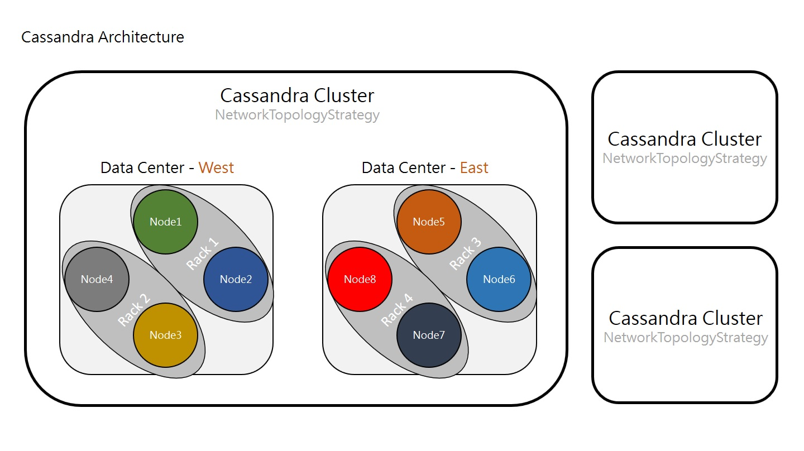

# Architecture

Cassandra is designed as the distributed database. The architecture design of Cassandra is the primary issue. The Unit in Cassandra can be a single database, a cluster, etc. It depends on your requirement. The following is the hierarchical  structure in Cassandra. 

* The unit to store the data distributedly is the cluster. The cluster contains several data centers.
* The single data center contains different nodes which can be considered as a physical storage or a computing machine. 
* If the node is implemented as the storage, it is also recommanded to implement on different racks. (It means one machine with different physical storages, for example, hardwares.) If the node is the computing machine, it can be spread around different locations.  

Cassandra databases can also be designed as two different data centers located on different locations, but both of them are belong to the same cluster.



The following implements a Cassandra distributed database system, which includes one cluster, one data center, and three nodes.

## Preparation

* Delete default data.

```bash
$ sudo systemctl stop cassandra
$ sudo systemctl status cassandra

# remember to remove current data in order to join the existing cluster
sudo rm -rf /var/lib/cassandra/data/system/*
```

## Configuration

* Configure the Cassandra system.

```bash
# edit the configuration
$ sudo vim /etc/cassandra/cassandra.yaml
```

* Set parameters as the following.

```ini
# Set the cluster name of the current node. 
# It is used to distinguish from other clusters.
# Nodes in the same cluster must have the same cluster name.
cluster_name: 'Example Cluster'

...

# It is a comma-delimited list of IP of each node in the cluster.
# The following are three examples for three nodes.
seed_provider:
    # Addresses of hosts that are deemed contact points.
    # Cassandra nodes use this list of hosts to find each other and learn
    # the topology of the ring.  You must change this if you are running
    # multiple nodes!
    - class_name: org.apache.cassandra.locator.SimpleSeedProvider
      parameters:
          # seeds is actually a comma-delimited list of addresses.
          # Ex: "<ip1>,<ip2>,<ip3>"
          - seeds: "192.168.1.25,192.168.1.66,192.168.1.234"
          - seeds: "192.168.1.66,192.168.1.25,192.168.1.234"
          - seeds: "192.168.1.234,192.168.1.66,192.168.1.25"

...

# It is the current node's IP.
# The ip address that other nodes in the cluster will use to connect to this one.
listen_address: 192.168.1.25

...

# The ip address for rpc(remote procedure calls). 
# The default value is localhost and leave this as is. Otherwise, change to server's IP address or the loopback address (127.0.0.1).
rpc_address: 192.168.1.25

...

# Name of snitch, which tells cassandra about what its network looks like. 
# Default is SimpleSnitch, which is used for networks in one datacenter. 
# Change it to GossipingPropertyFileSnitch for multiple datacenters and it is preferred for production setups.
endpoint_snitch: GossipingPropertyFileSnitch

...

# The directive is not in the configuration file, so it has to be added and set to false.
# Only the first node added to the cluster is needed to set the flag, others don't.
auto_bootstrap: false
```

* **Set the above configuration to the all nodes.**

* Restart the Cassandra Service.

```bash
sudo systemctl start cassandra
sudo systemctl status cassandra
```

## Cassandra System Information

* Use `nodetool` to check current node information.

```bash
# check the state of the cluster
# maybe only local node listed due to not yet communicating with other nodes
$ sudo nodetool status
```

* The possible information may be the below.

```bash
Datacenter: dc1
===============
Status=Up/Down
|/ State=Normal/Leaving/Joining/Moving
--  Address        Load       Tokens       Owns    Host ID                               Rack
UN  192.168.1.25   294.74 KiB  256          ?       f00ee7d1-51d1-4c2b-94a2-1c610f54994f  rack1
UN  192.168.1.234  215.91 KiB  256          ?       7a87757e-c8af-46b1-a708-639d069bb74e  rack1
UN  192.168.1.66   278.72 KiB  256          ?       3165f561-6e24-4b01-b05e-b47b9301d142  rack1
```

## Network

* In order to communicate with other nodes, we will need to open network ports for each node:

1. `7000` : TCP port for commands and data
2. `9042` : TCP port for the native transport server and `cqlsh`, the cassandra command line untity, will connect to the cluster through it.

* Edit the firewall rules. For example in ubuntu:

```bash
$ sudo ufw disable
$ sudo ufw allow in 7000
$ sudo ufw allow in 9042
$ sudo ufw enable
```


