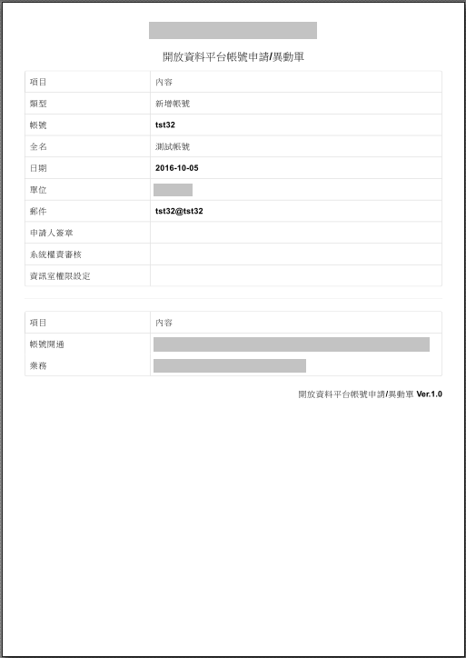

# 帳號審核清單

<script type="text/javascript" src="../js/general.js"></script>

### 使用時機
---

* 當該組織需有效性管理帳號時，可以透過申請單方式進行

### 透過前端 javascript 建立列印表單
---

* 於 javascript library 中建立要呈現的表單格式

```bash
(default) $ vim /usr/lib/ckan/default/src/ckan/ckan/public/base/javascript/custom/register.js
```

* 函式內容如下

```js
/*
* desc : print the desired content of html
* param@appType : 新增/變更
* param@acc : 帳號 (英文數字)
* param@fullName : UTF-8 格式字串
* param@getDate : yyyy-MM-DD
* param@org : 要加入的組織
* param@email : 使用的 email
*/
function printDiv(
  appType,
  acc,
  fullName,
  getDate,
  org,
  email
) {
  // get the inner content
  var oldPage = document.body.innerHTML;
  var oldTitle = document.title;

  // reset the content for printing
  var content = "";
  content += "<html><head><title>帳號開通變更申請單</title></head><body>";
  content += '<h1 style="font-weight: bold; text-align: center;">組織名稱</h1>';
  content += '<h3 style="font-weight: bold; text-align: center;">開放資料平台帳號申請/異動單</h3>';
  content += '<table class="table table-header table-hover table-bordered text-center" style="width: 100%;">';
  content += '<col width="30" /><col width="70" />';
  content += '<thead>';
  content += '<tr ><th scope="col">項目</th><th scope="col">內容</th></tr>';
  content += '</thead>';
  content += '<tbody>';
  content += '<tr><th scope="col" >類型</th><th scope="col">' + appType + '</th></tr>';
  content += '<tr><th scope="col" >帳號</th><th scope="col">' + acc + '</th></tr>';
  content += '<tr><th scope="col" >全名</th><th scope="col">' + fullName + '</th></tr>';
  content += '<tr><th scope="col" >日期</th><th scope="col">' + getDate + '</th></tr>';
  content += '<tr><th scope="col" >單位</th><th scope="col">' + org + '</th></tr>';
  content += '<tr><th scope="col" >郵件</th><th scope="col">' + email + '</th></tr>';
  content += '<tr><th scope="col" >申請人簽章</th><th scope="col"></th></tr>';
  content += '<tr><th scope="col" >系統權責審核</th><th scope="col"></th></tr>';
  content += '<tr><th scope="col" >資訊室權限設定</th> <th scope="col"></th></tr>';
  content += '</tbody>';
  content += '</table>';
  content += '<hr />';
  content += '<table class="table table-header table-hover table-bordered text-center" style="width: 100%;">';
  content += '<col width="30" /><col width="70" />';
  content += '<thead>';
  content += '<tr><th scope="col">項目</th><th scope="col">內容</th></tr>';
  content += '</thead>';
  content += '<tbody>';
  content += '<tr><th scope="col">帳號開通</th><th scope="col" style="text-align: left;">資訊室負責人</th></tr>';
  content += '<tr><th scope="col">業務</th><th scope="col" style="text-align: left;">業務負責</th></tr>';
  content += '</tbody>';
  content += '</table>';
  content += '<h5 style="text-align: right;">開放資料平台帳號申請/異動單 Ver.1.0</h5>';
  content += "</body></html>";
  document.body.innerHTML = content;
  document.title = '開放資料帳號申請-變更單 - ' + fullName;

  // print Page
  window.print();

  // restore the content for showing
  document.body.innerHTML = oldPage;
  document.title = oldTitle;
}
```

* 加入此 register.js 入 resource.config 中

### 定義 helpers.py 函式
---

* 伺服器用來取得資料庫內容

```bash
(default) $ vim /usr/lib/ckan/default/src/ckan/ckan/lib/helpers.py
```

* 可以參考 helpers.py 定義與設定

* 重啟 ckan 服務即可

### 加入註冊頁面中
---

* 列印選項

```bash
(default) $ vim /usr/lib/ckan/default/src/ckan/ckan/templates/user/register_complete.html
```

* 將 request body 傳入註冊頁面中 (修改 ** templates/user/register_complete.html ** )

```html

  <section class="module">
    <div class="module-content">
      <h1 class="page-heading">
      {{ h.getLangLabel("Hi! " + crtUser + " has been registered on the platform","您好，帳號 " + crtUser + " 已於平台註冊完成") }}
      </h1>
      {# register document, and send request.body #}
      
      <hr />
      {# contact document #}
      
    </div>
  </section>

```

* 加入列印選項，修改 ** templates/snippets/register.html ** (需配合上述 javascript)

```html
      <!-- -->
      
      <tr>
        <th scope="col">{{ h.getLangLabel("Activate account","帳號開通") }}</th>
        <th scope="col">
          <a href="#" onclick="javascript:printDiv('新增帳號','{{ h.getPostRequestParamValue(reqBody, 'name') }}','{{ h.getAccInfo('fullName', reqBody) }}', '{{ h.getAccInfo('getDate', reqBody) }}', '{{ h.getAccInfo('org', reqBody) }}', '{{ h.getAccInfo('email', reqBody) }}' );"><i class="icon-download"></i> {{ h.getLangLabel("Download Application","申請單下載") }}</a>
        </th>
        <th scope="col">{{ h.getLangLabel("tax to 02-23959825 #3628 or email to smalla@cdc.gov.tw","傳真至 02-23959825 #3628 或寄至 smalla@cdc.gov.tw") }}</th>
      </tr>
      
      <!-- -->
```

* 類似結果如下圖




