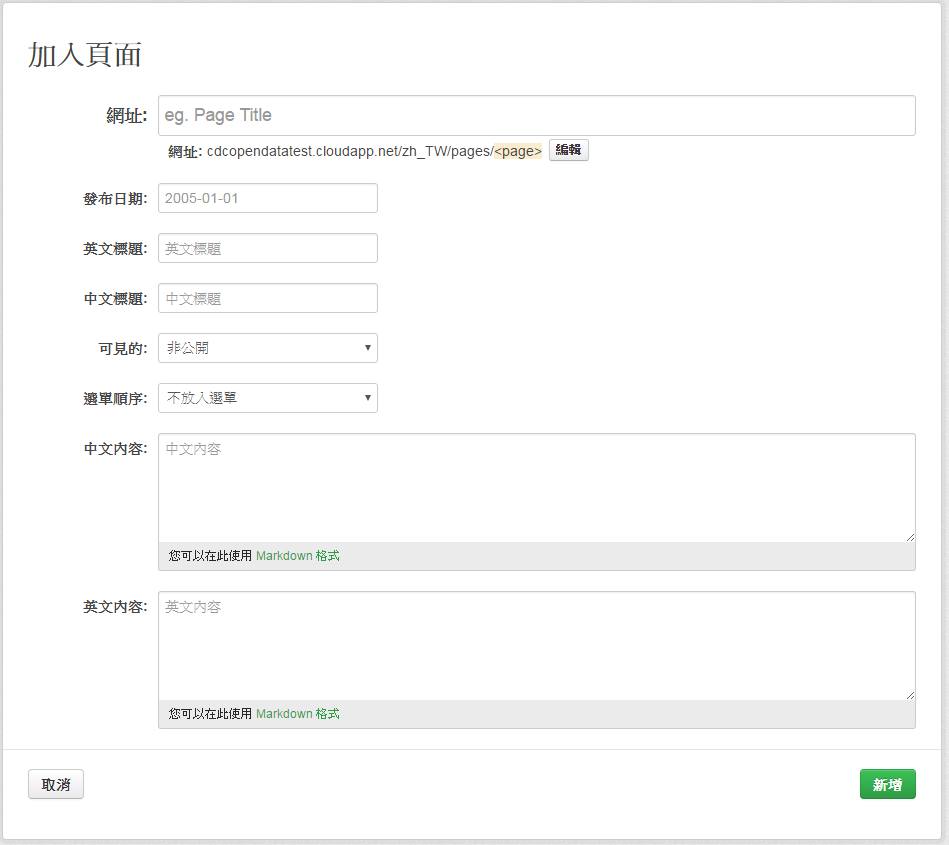

# ckanext-pages

<script type="text/javascript" src="../js/general.js"></script>

* ckanext-pages source 
  * 原 ckan 模組 : [https://github.com/ckan/ckanext-pages](https://github.com/ckan/ckanext-pages) 
  * 自製模組 (by forking) : [https://github.com/jiankaiwang/ckanext-pages](https://github.com/jiankaiwang/ckanext-pages)

### 下載並安裝
---

* 透過 github 直接安裝於 ckan 中

```bash
# 進入虛擬環境
. /usr/lib/ckan/default/bin/activate

# 透過 pip 進行安裝
pip install -e 'git+https://github.com/ckan/ckanext-pages.git#egg=ckanext-pages'

# 安裝完後會置於底下環境
/usr/lib/ckan/default/src/ckanext-pages/
  |- ckanext/pages/
    |- theme/
      |- templates_main/
        |- header.html	# 登入後的編輯窗格
        |- ckanext_pages/
          |- page.html  # page 的網站地圖(注意 plugin 中的 after_map 定義), 主呈現頁面
          |- blog.html  # blog 的網站地圖(注意 plugin 中的 after_map 定義), blog 清單列表
          |- blog.list  # blog 
            |- snippets/pages_list.html # blog 與 pages 的編輯頁面
          |- base_form.html  # 修改 page 或 blog 的編輯表格
    |- plugin.py : 修改主選單
```

### 使用 pages plugin
---

```bash
# 於組態檔中使用此 plugin
vim /etc/ckan/default/production.ini

# 並於 ckan.plugins 中加入 pages
ckan.plugins = pages

# ckeanext-pages settings : 使用不同的 editor，預設為 markdown
#ckanext.pages.editor = ckeditor
```

### 修改欄位資訊
---

* 主要修改欄位資料位置如下

```bash
/usr/lib/ckan/default/src/ckanext-pages/
  |- ckanext/pages/
    |- actions.py # schema, __page_list, _page_update
    |- controller.py # org_edit, group_edit
    |- db.py # init_db x 2 (sql 指令, 有新增要加上 DROP TABLE ckanext_pages; 無則刪除此行)
    |- plugin.py (TextBoxView,, build_pages_nav_main x 2)  # 同時也是修改 page 與 blog 主選單
      |- theme/
        |- templates_main/
          |- ckanext_pages/
            |- base_form.html  # 修改欄位
```

* 修改 actions.py 內容如下

```python
...

# customized : add english and chinese
schema = {
    'id': [p.toolkit.get_validator('ignore_empty'), unicode],
    'title': [p.toolkit.get_validator('not_empty'), unicode],
    'ename': [p.toolkit.get_validator('not_empty'), unicode],
    'cname': [p.toolkit.get_validator('not_empty'), unicode],
    'name': [p.toolkit.get_validator('not_empty'), unicode,
             p.toolkit.get_validator('name_validator'), page_name_validator],
    'content': [p.toolkit.get_validator('ignore_missing'), unicode],
    'econtent': [p.toolkit.get_validator('ignore_missing'), unicode],
    'page_type': [p.toolkit.get_validator('ignore_missing'), unicode],
  #  'lang': [p.toolkit.get_validator('not_empty'), unicode],
    'order': [p.toolkit.get_validator('ignore_missing'),
              unicode],
    'private': [p.toolkit.get_validator('ignore_missing'),
                p.toolkit.get_validator('boolean_validator')],
    'group_id': [p.toolkit.get_validator('ignore_missing'), unicode],
    'user_id': [p.toolkit.get_validator('ignore_missing'), unicode],
    'created': [p.toolkit.get_validator('ignore_missing'),
                p.toolkit.get_validator('isodate')],
    'publish_date': [not_empty_if_blog,
                     p.toolkit.get_validator('ignore_missing'),
                     p.toolkit.get_validator('isodate')],
}

...

def _pages_list(context, data_dict):
  ...
  
    # customized
    for pg in out:
        parser = HTMLFirstImage()
        parser.feed(pg.content)
        img = parser.first_image
        pg_row = {'title': pg.title,
                  'ename': pg.ename,
                  'cname': pg.cname,
                  'content': pg.content,
                  'econtent': pg.econtent,
                  'name': pg.name,
                  'publish_date': pg.publish_date.isoformat() if pg.publish_date else None,
                  'group_id': pg.group_id,
                  'page_type': pg.page_type,
                 }
        if img:
            pg_row['image'] = img
        extras = pg.extras
        if extras:
            pg_row.update(json.loads(pg.extras))
        out_list.append(pg_row)
    return out_list

...

def _pages_update(context, data_dict):
  ...
    items = ['title', 'ename', 'cname', 'content', 'econtent', 'name', 'private',
             'order', 'page_type', 'publish_date']
  ...
```

* 修改 controller.py 內容如下

```python
def group_edit(self, id, page=None, data=None, errors=None, error_summary=None):
    ...
    
        if p.toolkit.request.method == 'POST' and not data:
            data = p.toolkit.request.POST
            # customized
            items = ['title', 'ename', 'cname', 'name', 'content', 'econtent', 'private']
            # update config from form
            for item in items:
                if item in data:
                    _page[item] = data[item]
            _page['org_id'] = p.toolkit.c.group_dict['id']
            _page['page'] = page
            try:
                junk = p.toolkit.get_action('ckanext_pages_update')(
                    data_dict=_page
                )
            except p.toolkit.ValidationError, e:
                errors = e.error_dict
                error_summary = e.error_summary
                return self.group_edit(id, '/' + page, data,
                                 errors, error_summary)
            p.toolkit.redirect_to(p.toolkit.url_for('group_pages', id=id, page='/' + _page['name']))
        
        ...
        
def org_edit(self, id, page=None, data=None, errors=None, error_summary=None):
    
    ...

        if p.toolkit.request.method == 'POST' and not data:
            data = p.toolkit.request.POST
            # customized
            items = ['title', 'ename', 'cname', 'name', 'content', 'econtent', 'private']
            # update config from form
            for item in items:
                if item in data:
                    _page[item] = data[item]
            _page['org_id'] = p.toolkit.c.group_dict['id'],
            _page['page'] = page
            try:
                junk = p.toolkit.get_action('ckanext_pages_update')(
                    data_dict=_page
                )
            except p.toolkit.ValidationError, e:
                errors = e.error_dict
                error_summary = e.error_summary
                return self.org_edit(id, '/' + page, data,
                                 errors, error_summary)
            p.toolkit.redirect_to(p.toolkit.url_for('organization_pages', id=id, page='/' + _page['name']))
    ...
```

* 修改 db.py 內容如下
  1. 重新安裝時，若有新增欄位，則要加上 DROP TABLE ckanext_pages;
  2. 重新安裝時，若無新增欄位，則再將 DROP TABLE ckanext_pages; 移除

```python
def init_db(model):

  ...

    # We will just try to create the table.  If it already exists we get an
    # error but we can just skip it and carry on.
		
	# customized
    sql = '''
                CREATE TABLE ckanext_pages (
                    id text NOT NULL,
                    title text,
                    ename text,
                    cname text,
                    name text,
                    content text,
                    econtent text,
                    lang text,
                    "order" text,
                    private boolean,
                    group_id text,
                    user_id text NOT NULL,
                    created timestamp without time zone,
                    modified timestamp without time zone
                );
    '''
  
  ...
  
    pages_table = sa.Table('ckanext_pages', model.meta.metadata,
        sa.Column('id', types.UnicodeText, primary_key=True, default=make_uuid),
        sa.Column('title', types.UnicodeText, default=u''),
        sa.Column('ename', types.UnicodeText, default=u''),
        sa.Column('cname', types.UnicodeText, default=u''),
        sa.Column('name', types.UnicodeText, default=u''),
        sa.Column('content', types.UnicodeText, default=u''),
        sa.Column('econtent', types.UnicodeText, default=u''),
        sa.Column('lang', types.UnicodeText, default=u''),
        sa.Column('order', types.UnicodeText, default=u''),
        sa.Column('private',types.Boolean,default=True),
        sa.Column('group_id', types.UnicodeText, default=None),
        sa.Column('user_id', types.UnicodeText, default=u''),
        sa.Column('publish_date', types.DateTime),
        sa.Column('page_type', types.DateTime),
        sa.Column('created', types.DateTime, default=datetime.datetime.utcnow),
        sa.Column('modified', types.DateTime, default=datetime.datetime.utcnow),
        sa.Column('extras', types.UnicodeText, default=u'{}'),
        extend_existing=True
    )
  
```

* 修改 plugin.py 內容

```python
def build_pages_nav_main(*args):
  ...
  
    for page in pages_list:
        if page['page_type'] == 'blog':
            # customized
            link = h.link_to( h.getLangLabel(page['ename'], page['cname']),
                             h.url_for('/blog/' + str( page['name'] )))
        else:
            # customized
            link = h.link_to( h.getLangLabel(page['ename'], page['cname']),
                             h.url_for('/pages/' + str( page['name'] )))

        if page['name'] == page_name:
            li = h.literal('<li class="active">') + link + h.literal('</li>')
        else:
            li = h.literal('<li>') + link + h.literal('</li>')
        output = output + li
  
  ...
  
def TextBoxView(p.SingletonPlugin):
  ...
  
    def info(self):
        schema = {
            'content': [ignore_missing],
            'econtent': [ignore_missing],
        }

        # customized
        return {'name': 'wysiwyg',
                'ename': 'Free Text',
                'cname': 'Free Text',
                'title': 'Free Text',
                'icon': 'pencil',
                'iframed': False,
                'schema': schema,
                }
  
  ...
```

* 安裝此 plugin.py

```bash
# 透過 setup.py 安裝
cd /usr/lib/ckan/default/src/ckanext-pages/
python ./setup.py install

# 重啟 ckan
sudo restart ckan
```

* 設計新的編輯畫面

```bash
# 主要編輯路徑如下
/usr/lib/ckan/default/src/ckanext-pages/
  |- ckanext/pages/
    |- theme/
      |- templates_main/
        |- ckanext_pages/
          |- base_form.html  # 修改欄位
```

* 修改 base_form.html 內容如下

```html







  
  
  
  
  

  
  
  
  
  

  {# customized #}
  
  
  
  
  
     
  

  {# customized #}
  
  
  
  
  
     
  




    
      <h1>{{ h.getLangLabel("Add Blog Article","加入文章") }}</h1>
    
      <h1>{{ h.getLangLabel("Edit Blog Article","編輯文章") }}</h1>
    
    
    

    
      <h1>{{ h.getLangLabel("Add Page","加入頁面") }}</h1>
    
      <h1>{{ h.getLangLabel("Edit Page","編輯頁面") }}</h1>
    
    
    



<form class="form-horizontal" method="post" action="{{ action_url }}" data-module="basic-form">
  {# customized #}
  {{ form.input('title', id='field-title', label=h.getLangLabel("Website","網址"), placeholder=title_placeholder, value=data.title, error=errors.title, classes=['control-full', 'control-large'], attrs={'data-module': 'slug-preview-target'}) }}

  
  
  {{ form.prepend('name', id='field-name', label=_('URL'), prepend=slug_prefix, placeholder=_(url_placeholder), value=data.name, error=errors.name, attrs=attrs) }}

  {# customized #}
  {{ form.input('publish_date', id='field-publish_date', label=h.getLangLabel("Publish Date","發布日期"), placeholder=_('2005-01-01'), value=data.publish_date, error=errors.publish_date, classes=[], attrs={'data-module': 'datepicker', 'data-date-format': 'yyyy-mm-dd'}) }}

  
  

  {# customized #}
  {#
  {{ form.input('name', id='field-name', label=_('name'), placeholder=_('name'), value=data.name) }} 
  #}
  {{ form.input('ename', id='field-name', label=h.getLangLabel("Title in English","英文標題"), placeholder=h.getLangLabel("Title in English","英文標題"), value=data.ename) }}
  {{ form.input('cname', id='field-name', label=h.getLangLabel("Title in Chinese","中文標題"), placeholder=h.getLangLabel("Title in Chinese","中文標題"), value=data.cname) }}

  <div class="control-group">
    <label for="field-private" class="control-label">{{ _('Visibility') }}</label>
    <div class="controls">
      <select id="field-private" class="form-control" name="private">
        
        <option value="{{ option[0] }}" selected="selected">{{ option[1] }}</option>
        
      </select>
    </div>
  </div>

  
    <div class="control-group">
      <label for="field-order" class="control-label">{{ h.getLangLabel("Menu Order","選單順序") }}</label>
      <div class="controls">
        <select id="field-order" class="form-control" name="order">
            
          <option value="{{ option[0] }}" selected="selected">{{ option[1] }}</option>
          
        </select>
      </div>
    </div>
  

  
  
    {{ wysiwyg.editor('content', id='field-content', label=_('Content'), placeholder=_('Enter content here'), value=data.content|safe, error=errors.content) }}
  
    
    <div class="control-group">
        <label for="field-content-ck" class="control-label">{{ h.getLangLabel("Content","內容") }}</label>
    </div>
    <textarea id="field-content-ck" name="content" placeholder="{{_('My content')}}" data-module="ckedit" style="height:400px" data-module-site_url="{{ h.dump_json(h.url('/', locale='default', qualified=true)) }}"> {{ data.content }}</textarea>
  
    {# customized #}
    {{ form.markdown('content', id='field-content', label=h.getLangLabel("Content in Chinese","中文內容"), placeholder=h.getLangLabel("Content in Chinese","中文內容"), value=data.content, error=errors.content) }}
    {{ form.markdown('econtent', id='field-content', label=h.getLangLabel("Content in English","英文內容"), placeholder=h.getLangLabel("Content in English","英文內容"), value=data.econtent, error=errors.content) }}
  

  <div class="form-actions">
    
      <a class="btn pull-left" href="{{ cancel_url }}">{{ _('Cancel') }}</a>
      <button class="btn btn-primary" name="save" value="save" type="submit">{{ _('Add') }}</button>
    

      
        
          
          <a class="btn btn-danger pull-left" href="{{ delete_url }}" data-module="confirm-action" data-module-i18n="{{ locale }}">{{ _('Delete') }}</a>
        
      

      <button class="btn btn-primary" name="save" value="save" type="submit">{{ _('Save') }}</button>
    
  </div>

</form>
```

* 重新安裝並重啟服務

```bash
# 透過 setup.py 安裝
cd /usr/lib/ckan/default/src/ckanext-pages/
python ./setup.py install

# 重啟服務
sudo restart ckan
```

* 結果如下圖



### 調整語言頁面
---

* 路徑如下

```
/usr/lib/ckan/default/src/ckanext-pages/
  |- ckanext/pages/
    |- theme/
      |- templates_main/
        |- ckanext_pages/
          |- blog_list.html  # blog 
              |- snippets/pages_list.html # blog 與 pages 的列表
```

* 修改 snippets/pages_list.html 內容如下

```html



{#

  <h2>{{ _('1 blog article') if pages_total == 1 else _('{0} blog articles').format(pages_total) }}</h2>

  <h2>{{ _('1 page') if pages_total == 1 else _('{0} pages').format(pages_total) }}</h2>

#}


  <h2>{{ h.getLangLabel("News List","訊息列表") }}</h2>

  <h2>{{ h.getLangLabel("Pages List","頁面列表") }}</h2>



  

    
       {# this is for orgs and groups #}
        
      
        
      
        
      
      <div class="row page-list-item dataset-item">
      
        <div class="span3 image">
          <a style="background-image:url({{ page.image }})" href="{{ url }}">
          </a>
        </div>
        <div class="span8">
           <h3 class="dataset-heading">
              {# customized #}
              <a href="{{ url }}" ><i class="icon-pushpin"></i> {{ h.getLangLabel(page.ename, page.cname) }}</a>
              
                 <small class="date"> {{ h.render_datetime(page.publish_date) }} </small>
              
            </h3>
            
              
              <div>
                {{h.getLangLabel(page.econtent, page.content)|striptags|truncate}}
              </div>
              
                {{ h.markdown_extract(h.getLangLabel(page.econtent, page.content)) }}
              
            
              <p class="empty">{{ _('This page currently has no content') }}</p>
            
        </div>
      
        <div class="span11">
          <h3 class="dataset-heading">
            <a href="{{ url }}" ><i class="icon-pushpin"></i> {{ h.getLangLabel(page.ename, page.cname) }}</a>
            
               <small class="date"> {{ h.render_datetime(page.publish_date) }} </small>
            
          </h3>
          
            
            <div>
              {{h.getLangLabel(page.econtent, page.content)|striptags|truncate}}
            </div>
            
              {{ h.markdown_extract(h.getLangLabel(page.econtent, page.content)) }}
            
          
            <p class="empty">{{ _('This page currently has no content') }}</p>
          
        </div>
      
      </div>
    


    
      <p class="empty">{{ _('There are currently no blog articles here') }}</p>
    
      <p class="empty">{{ _('There are currently no pages here') }}</p>
    

```

* 修正 templates_main/ckanext_pages/blog.html 內容 : blog 清單內容，包含加入網站地圖

```html

{{ super() }} class="blog"
{{ c.page.title }}

{# customized #}

    <div class="toolbar">
        
            <ol class="breadcrumb">
                
                <li class="active"></li>
            </ol>
        
        </div>



  <section class="module-content">
    
      
    
    <h1 class="page-heading">{{ h.getLangLabel(c.page.ename, c.page.cname) }}</h1>
      
         <span class="muted date"> {{ h.render_datetime(c.page.publish_date) }} </span>
      
    
      
      
        <div>
            {{c.page.content|safe}}
        </div>
      
        {{ h.render_content(h.getLangLabel(c.page.econtent, c.page.content)) }}
      
    
      <p class="empty">{{ _('This page currently has no content') }}</p>
    
  </section>





  <div class="module module-narrow module-shallow">
    <h2 class="module-heading">
      {# customized #}
      {{ h.getLangLabel("history","歷史訊息") }}
    </h2>
    <div class="module-content">
        
            <div class="blog-title">
                <h3 class="dataset-heading">
                    <a href="{{ h.url_for(controller='ckanext.pages.controller:PagesController', action='blog_show', page='/' + post.name) }}">{{ h.getLangLabel(post.ename, post.cname) }}</a>
                    <br>
                    
                        <small> {{ h.render_datetime(post.publish_date) }} </small>
                    
                </h3>
            </div>
            <div class="blog-content">
                {{ h.markdown_extract(h.getLangLabel(post.econtent,post.content)) }}
                
                   <br>
                   <a class="btn btn-small btn-primary more" href="{{ h.url_for(controller='ckanext.pages.controller:PagesController', action='blog_show', page='/' + post.name) }}">{{ _('More') }}</a>
                
            </div>
        
    </div>
  </div>



```

* 修正 templates_main/ckanext_pages/page.html 內容 : page 清單內容，包含加入網站地圖

```html


{{ c.page.title }}

{# customized #}

    <div class="toolbar">
        
            <ol class="breadcrumb">
                
                <li class="active"></li>
            </ol>
        
    </div>



  <section class="module-content">
    
      
    
    {# customized #}
    
      <h1 class="page-heading">{{ h.getLangLabel(c.page.ename,c.page.cname) }}</h1>
      <div class="ckanext-pages-content">
        
        
          <div>
              {{c.page.content|safe}}
          </div>
        
          {# customized #}
          {{ h.getLangLabel(h.render_content(c.page.econtent),h.render_content(c.page.content)) }}
          
              
          
              
          
        
      </div>
    
      <p class="empty">{{ _('This page currently has no content') }}</p>
    
  </section>



```

* 移除 sql 中 drop database 指令，重新安裝並重啟服務

```bash
# 編輯 db.py 
cd /usr/lib/ckan/default/src/ckanext-pages/
vim ./ckanext/pages/db.py

# 將 drop database 指令去除 ** DROP TABLE ckanext_pages; ** 如下
sql = '''
                CREATE TABLE ckanext_pages (
                    id text NOT NULL,
                    title text,
       ...
```

```bash
# 透過 setup.py 安裝
cd /usr/lib/ckan/default/src/ckanext-pages/
python ./setup.py install

# 重啟服務
sudo restart ckan
```

