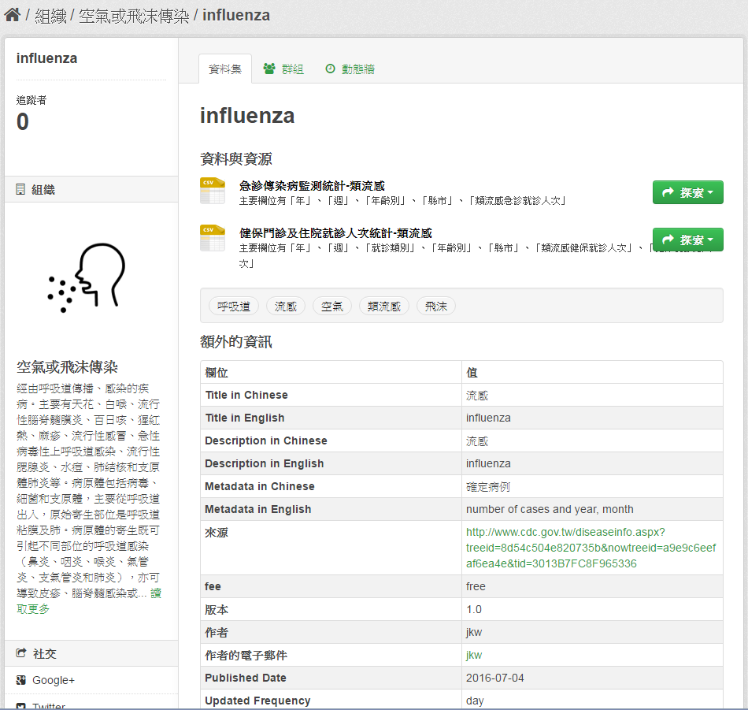

# ckanext-scheming

<script type="text/javascript" src="../js/general.js"></script>

* ckanext-scheming source 
  * 原 ckan 模組 : [https://github.com/ckan/ckanext-scheming](https://github.com/ckan/ckanext-scheming) 
  * 自製模組 (by forking) : [https://github.com/jiankaiwang/ckanext-scheming](https://github.com/jiankaiwang/ckanext-scheming)

### 下載
---

* 預先安裝必要 package : ckantoolkit, ckanapi

```bash
# 必須確認進入虛擬環境 (因 ckan 執行為 sandbox-based 環境)
. /usr/lib/ckan/default/bin/activate

# 透過 pip 進行安裝
pip2 install ckantoolkit
pip2 install ckanapi

# 檢查是否安裝成功
pip2 list
```

* 自 github 安裝 by http protocol

```
# 放置在 ckan 預設放置 plugin 路徑
$ cd /usr/lib/ckan/default/src/ckan/ckanext

# 取得原 plugin 模組的 http url
$ git clone https://github.com/ckan/ckanext-scheming.git

# clone 後的內容會放置在
$ cd /usr/lib/ckan/default/src/ckan/ckanext/ckanext-scheming/
```

### 設定必要組態檔
---

* 設訂新的 group schema 內容，此 plugin 透過 json 來設定 schema，** ckanext/scheming/group_with_bookface.json **

```javascript
{
  "scheming_version": 1,
  "group_type": "group",
  "about_url": "http://github.com/ckan/ckanext-scheming",
  "fields": [
    {
      "field_name": "title",
      "label": "中文名稱",
      "validators": "ignore_missing unicode",
      "form_snippet": "large_text.html",
      "form_attrs": {"data-module": "slug-preview-target"},
      "form_placeholder": "中文名稱"
    },
    {
      "field_name": "etitle",
      "label": "English Name",
      "validators": "ignore_missing unicode",
      "form_snippet": "large_text.html",
      "form_attrs": {"data-module": "slug-preview-target"},
      "form_placeholder": "group name in English"
    },
    {
      "field_name": "name",
      "label": "URL",
      "validators": "not_empty unicode name_validator group_name_validator",
      "form_snippet": "slug.html",
      "form_placeholder": "my-organization"
    },
    {
      "field_name": "notes",
      "label": "中文敘述",
      "form_snippet": "markdown.html",
      "form_placeholder": "中文敘述"
    },
    {
      "field_name": "enotes",
      "label": "English Description",
      "form_snippet": "markdown.html",
      "form_placeholder": "Description in English"
    },
    {
      "field_name": "url",
      "label": "Image URL",
      "form_placeholder": "http://example.com/my-image.jpg"
    }
  ]
}
```

* 設訂新的 organization schema 內容，此 plugin 透過 json 來設定 schema，** ckanext/scheming/org_with_dept_id.json **

```javascript
{
  "scheming_version": 1,
  "organization_type": "organization",
  "about_url": "http://github.com/ckan/ckanext-scheming",
  "fields": [
    {
      "field_name": "title",
      "label": "中文名稱",
      "validators": "ignore_missing unicode",
      "form_snippet": "large_text.html",
      "form_attrs": {"data-module": "slug-preview-target"},
      "form_placeholder": "組織中文名稱"
    },
    {
      "field_name": "etitle",
      "label": "English Name",
      "validators": "ignore_missing unicode",
      "form_snippet": "large_text.html",
      "form_attrs": {"data-module": "slug-preview-target"},
      "form_placeholder": "Organization Name in English"
    },
    {
      "field_name": "name",
      "label": "URL",
      "validators": "not_empty unicode name_validator group_name_validator",
      "form_snippet": "slug.html",
      "form_placeholder": "my-organization"
    },
    {
      "field_name": "notes",
      "label": "中文描述",
      "form_snippet": "markdown.html",
      "form_placeholder": "關於組織資訊 ...."
    },
    {
      "field_name": "enotes",
      "label": "English Description",
      "form_snippet": "markdown.html",
      "form_placeholder": "A little information about my organization in English."
    },
    {
      "field_name": "url",
      "label": "Image URL",
      "form_placeholder": "http://example.com/my-image.jpg"
    },
    {
      "field_name": "department_id",
      "label": "Department ID",
      "form_placeholder": "e.g. 1042"
    }
  ]
}
```

* 設定新 data schema 列表，此 plugin 透過 json 來設定 schema，底下舉例為 customized_schema.json

```bash
# 存放 schema.json 位置
cd /usr/lib/ckan/default/src/ckan/ckanext/ckanext-scheming/ckanext/scheming/
vim ./customized_schema.json
```

假設底下為要新增的欄位 (preset 參考下方新定義)

| 欄位名稱 | shema | 資料形態或參考表格 | 說明 |
| -- | -- | -- | -- |
| website | title | "preset" 為 "title" | 顯示網址 |
| Title in Chinese | c_title | text | 中文標題，於中文網頁顯示 |
| Title in English | e_title | text | 英文標題，於英文網頁顯示 |
| URL | name | "preset" 為 "dataset_slug" | 儲存網址 |
| Description in Chinese | cd_notes | "preset" 為 "note_meta" | 資料集中文描述 |
| Description in English | ed_notes | "preset" 為 "note_meta" | 資料集英文描述 |
| Metadata in Chinese | cm_notes | "preset" 為 "note_meta" | 資料集中文欄位說明 |
| Metadata in English | em_notes | "preset" 為 "note_meta" | 資料集英文欄位說明 |
| Tags | tag_string | "preset" 為 "tag_string_autocomplete" | 資料集的標籤 |
| License | license_id | "form_snippet" 為 "license.html" | 資料集授選 |
| Organization | owner_org | "preset" 為 "dataset_organization" | 資料集釋出的組織 |
| Source | url | "display_snippet" 為 "link.html" | 資料說明頁面 |
| fee | fee | selector | 收費標準 |
| Version | version | text | 顯示資料版本 |
| Author | author | text | 顯示資料集作者 |
| Author Email | author_email | "display_snippet" 為 "email.html" | 作者電子郵件 |
| Published Date | pub_time | "form_snippet" 為 "date.html" | 發布時間 |
| Updated Frequency | updated_freq | selector | 更新頻率 |

新定義的 json 內容如下：

```javascript
{
  "scheming_version": 1,
  "dataset_type": "dataset",
  "about": "A reimplementation of the default CKAN dataset schema",
  "about_url": "http://github.com/ckan/ckanext-scheming",
  "dataset_fields": [
    {
      "field_name": "title",
      "label": "website",
      "preset": "title",
      "form_placeholder": "eg. A descriptive title"
    },
    {
      "field_name": "c_title",
      "label": "Title in Chinese",
      "form_placeholder": "eg. 登革熱",
      "validators": "ignore_missing unicode package_version_validator"
    },
    {
      "field_name": "e_title",
      "label": "Title in English",
      "form_placeholder": "eg. Dengue",
      "validators": "ignore_missing unicode package_version_validator"
    },
    {
      "field_name": "name",
      "label": "URL",
      "preset": "dataset_slug",
      "form_placeholder": "eg. my-dataset"
    },
    {
      "field_name": "cd_notes",
      "label": "Description in Chinese",
      "preset": "note_meta",
      "form_placeholder": "eg. 2003年起各地區、各年齡層、性別之病例數統計表"
    },
    {
      "field_name": "ed_notes",
      "label": "Description in English",
      "preset": "note_meta",
      "form_placeholder": "eg. The statistical data to determined cases on the age group and gender in Taiwan since 2003."
    },
    {
      "field_name": "cm_notes",
      "label": "Metadata in Chinese",
      "preset": "note_meta",
      "form_placeholder": "eg. 主要欄位有「確定病名」、「發病年份」、「發病月份」、「縣市」、「性別」、「年齡層」、「確定病例數」"
    },
    {
      "field_name": "em_notes",
      "label": "Metadata in English",
      "preset": "note_meta",
      "form_placeholder": "eg. Columns include disease name, year of onset, month of onset, county name, gender, age group and determined number of cases."
    },
    {
      "field_name": "tag_string",
      "label": "Tags",
      "preset": "tag_string_autocomplete",
      "form_placeholder": "eg. economy, mental health, government"
    },
    {
      "field_name": "license_id",
      "label": "License",
      "form_snippet": "license.html",
      "help_text": "License definitions and additional information can be found at http://opendefinition.org/"
    },
    {
      "field_name": "owner_org",
      "label": "Organization",
      "preset": "dataset_organization"
    },
    {
      "field_name": "url",
      "label": "Source",
      "form_placeholder": "http://example.com/dataset.json",
      "display_property": "foaf:homepage",
      "display_snippet": "link.html"
    },
    {
      "field_name": "fee",
      "label": "fee",
      "choices": [
	{ "value": "toll", "label": "toll" },
        { "value": "free", "label": "free" }
      ],
      "form_snippet": "select.html",
      "display_snippet": "select.html"
    },
    {
      "field_name": "version",
      "label": "Version",
      "validators": "ignore_missing unicode package_version_validator",
      "form_placeholder": "1.0"
    },
    {
      "field_name": "author",
      "label": "Author",
      "form_placeholder": "Joe Bloggs",
      "display_property": "dc:creator"
    },
    {
      "field_name": "author_email",
      "label": "Author Email",
      "form_placeholder": "joe@example.com",
      "display_property": "dc:creator",
      "display_snippet": "email.html",
      "display_email_name_field": "author"
    },
    {
      "field_name": "pub_time",
      "label": "Published Date",
      "form_snippet": "date.html",
      "form_placeholder": "eg. 2016/07/20"
    },
    {
      "field_name": "updated_freq",
      "label": "Updated Frequency",
      "choices": [
        { "value": "year", "label": "year" },
        { "value": "month", "label": "month" },
        { "value": "day", "label": "day" },
        { "value": "once", "label": "once" },
        { "value": "non-scheduled", "label": "non-scheduled" }
      ],
      "form_snippet": "select.html",
      "display_snippet": "select.html"
    }
  ],
  "resource_fields": [
    {
      "field_name": "url",
      "label": "URL",
      "preset": "resource_url_upload"
    },
    {
      "field_name": "name",
      "label": "Name",
      "form_placeholder": "eg. January 2011 Gold Prices"
    },
    {
      "field_name": "description",
      "label": "Description",
      "form_snippet": "markdown.html",
      "form_placeholder": "Some useful notes about the data"
    },
    {
      "field_name": "format",
      "label": "Format",
      "preset": "resource_format_autocomplete"
    }
  ]
}
```

* 設定新參考定義 (presets.json) : 在上述的欄位定義也可以透過 preset 進行設置

```bash
cd /usr/lib/ckan/default/src/ckan/ckanext/ckanext-scheming/ckanext/scheming/
vim ./presets.json
```

```javascript
{
  "scheming_presets_version": 1,
  "about": "these are the default scheming field presets",
  "about_url": "http://github.com/ckan/ckanext-scheming#preset",
  "presets": [
    {
      "preset_name": "title",
      "values": {
        "validators": "if_empty_same_as(name) unicode",
        "form_snippet": "large_text.html",
        "form_attrs": {
          "data-module": "slug-preview-target"
        }
      }
    },
    {
      "preset_name": "note_meta",
      "values": {
        "validators": "if_empty_same_as(name) unicode",
        "form_snippet": "markdown.html"
      }
    },
    {
      "preset_name": "dataset_slug",
      "values": {
        "validators": "not_empty unicode name_validator package_name_validator",
        "form_snippet": "slug.html"
      }
    },
    {
      "preset_name": "tag_string_autocomplete",
      "values": {
        "validators": "ignore_missing tag_string_convert",
        "form_attrs": {
          "data-module": "autocomplete",
          "data-module-tags": "",
          "data-module-source": "/api/2/util/tag/autocomplete?incomplete=?"
        }
      }
    },
    {
      "preset_name": "dataset_organization",
      "values": {
        "validators": "owner_org_validator unicode",
        "form_snippet": "organization.html"
      }
    },
    {
      "preset_name": "resource_url_upload",
      "values": {
        "validators": "not_empty unicode remove_whitespace",
        "form_snippet": "upload.html",
        "form_placeholder": "http://example.com/my-data.csv",
        "upload_field": "upload",
        "upload_clear": "clear_upload",
        "upload_label": "File"
      }
    },
    {
      "preset_name": "resource_format_autocomplete",
      "values": {
        "validators": "if_empty_guess_format ignore_missing clean_format unicode",
        "form_placeholder": "eg. CSV, XML or JSON",
        "form_attrs": {
          "data-module": "autocomplete",
          "data-module-source": "/api/2/util/resource/format_autocomplete?incomplete=?"
        }
      }
    },
    {
      "preset_name": "select",
      "values": {
        "form_snippet": "select.html",
        "display_snippet": "select.html",
        "validators": "scheming_required scheming_choices"
      }
    },
    {
      "preset_name": "multiple_checkbox",
      "values": {
        "form_snippet": "multiple_checkbox.html",
        "display_snippet": "multiple_choice.html",
        "validators": "scheming_multiple_choice",
        "output_validators": "scheming_multiple_choice_output"
      }
    },
    {
      "preset_name": "multiple_select",
      "values": {
        "form_snippet": "multiple_select.html",
        "display_snippet": "multiple_choice.html",
        "validators": "scheming_multiple_choice",
        "output_validators": "scheming_multiple_choice_output"
      }
    },
    {
      "preset_name": "date",
      "values": {
        "form_snippet": "date.html",
        "display_snippet": "date.html",
        "validators": "scheming_required isodate convert_to_json_if_date"
      }
    },
    {
      "preset_name": "datetime",
      "values": {
        "form_snippet": "datetime.html",
        "display_snippet": "datetime.html",
        "validators": "scheming_isodatetime convert_to_json_if_datetime"
      }
    },
    {
      "preset_name": "datetime_tz",
      "values": {
        "form_snippet": "datetime_tz.html",
        "display_snippet": "datetime_tz.html",
        "validators": "scheming_isodatetime_tz convert_to_json_if_datetime"
      }
    }
  ]
}
```

* 設定組態檔案 (以 development.ini 為例)

```bash
# 編輯 development.ini
vim /etc/ckan/default/development.ini

# 於 plugins 底下加入 plugins 設定檔
scheming_datasets scheming_groups scheming_organizations

# 並加入 ckanext-scheming settings
# ckanext-scheming settings
scheming.dataset_schemas = ckanext.scheming:/usr/lib/ckan/default/src/ckan/ckanext/ckanext-scheming/ckanext/scheming/customized_schema.json
scheming.presets = ckanext.scheming:/usr/lib/ckan/default/src/ckan/ckanext/ckanext-scheming/ckanext/scheming/presets.json
scheming.dataset_fallback = false
scheming.organization_schemas = ckanext.scheming:org_with_dept_id.json
scheming.group_schemas = ckanext.scheming:group_with_bookface.json
```

### 安裝 plugins
---

* 先安裝於 development 環境下測試

```bash
# 對 setup.py 進行安裝
cd /usr/lib/ckan/default/src/ckan/ckanext/ckanext-scheming
python ./setup.py develop

# 在測試環境下運行 plugin
paster serve /etc/ckan/default/development.ini
```

* 安裝於 production 正式環境下

```bash
# 編輯 production.ini
vim /etc/ckan/default/production.ini

# 加入 plugins
scheming_datasets scheming_groups scheming_organizations

# 加入組態設定
# add ckanext-scheming settings
scheming.dataset_schemas = ckanext.scheming:/usr/lib/ckan/default/src/ckan/ckanext/ckanext-scheming/ckanext/scheming/customized_schema.json
scheming.presets = ckanext.scheming:/usr/lib/ckan/default/src/ckan/ckanext/ckanext-scheming/ckanext/scheming/presets.json
scheming.dataset_fallback = false
scheming.organization_schemas = ckanext.scheming:org_with_dept_id.json
scheming.group_schemas = ckanext.scheming:group_with_bookface.json

# 安裝於 production
python ./setup.py install

# 重啟 ckan 服務
$ sudo restart ckan
```

### 客製化資料集描述與欄位
---

* 完成安裝後，可能出現畫面如下



接續便是要將此畫面進行修正，包含將標題、說明與欄位資料依據語言顯示內容。

* 修正標題 (shema field 自 title 改成 c_title 或 e_title) 與描述 (自 notes 改成 ed_notes 或 cd_notes)

```bash
# 測試環境下的修改位置階層 (位於 plugin 資料夾)
/usr/lib/ckan/default/src/ckan/ckanext/ckanext-scheming/ckanext/scheming/
  |- template/scheming
    |- package/
      |- read.html  # 主要顯示頁面，修正標題處與描述
      
# 正式環境下的修改位置階層
/usr/lib/ckan/default/src/ckan/ckan
  |- /templates/
    |- package/
      |- read.html  # 主要顯示頁面，修正標題處與描述，包含資源與標籤引用
```

修改標題內容如下

```bash
    ...
    
    <h1>
      {# customized : modify dataset title #}
      
        
          {{ pkg.e_title or pkg.name }}
        
          {{ pkg.c_title or pkg.name }}
        

        
        ...
```

修改描述內容如下

```bash
      </h1>
      
        <div class="notes embedded-content">
          {# customized : modify dataset description #}
          
             {{ h.render_markdown(pkg.ed_notes) }}
          
             {{ h.render_markdown(pkg.cd_notes) }}
          
        </div>
      
      ...
```

* 修正額外欄位資訊

```bash
# 測試機與正式機的修改位置階層 (位於 template 資料夾)
/usr/lib/ckan/default/src/ckan/ckan/templates/
  |- package/
    |- snippets/
      |- additional_info.html
```

額外欄位內容顯示如下

```
{# customized metadata of the dataset #}

<section class="additional-info">
  <h3>{{ _('Additional Info') }}</h3>
  <table class="table table-striped table-bordered table-condensed">
    <thead>
      <tr>
        <th scope="col">{{ _('Field') }}</th>
        <th scope="col">{{ _('Value') }}</th>
      </tr>
    </thead>
    <tbody>

        
          <tr>
            <th scope="row" class="dataset-label">{{ h.getLangLabel("Metadata","欄位資訊") }}</th>
            
                <td class="dataset-details">{{ _(pkg_dict.em_notes) }}</td>
            
                <td class="dataset-details">{{ _(pkg_dict.cm_notes) }}</td>
            
          </tr>
        

        
          <tr>
            <th scope="row" class="dataset-label">{{ _('Source') }}</th>
            
              <td class="dataset-details" property="foaf:homepage">{{ h.link_to(pkg_dict.url, pkg_dict.url, rel='foaf:homepage', target='_blank') }}</td>
            
              <td class="dataset-details" property="foaf:homepage">{{ pkg_dict.url }}</td>
            
          </tr>
        

        
          <tr>
            <th scope="row" class="dataset-label">{{ h.getLangLabel("Fee","計費") }}</th>
            <td class="dataset-details">{{ _(pkg_dict.fee) }}</td>
          </tr>
        

        
          <tr>
            <th scope="row" class="dataset-label">{{ _("Version") }}</th>
            <td class="dataset-details">{{ pkg_dict.version }}</td>
          </tr>
        

        
          <tr>
            <th scope="row" class="dataset-label">{{ _("Author") }}</th>
            <td class="dataset-details" property="dc:creator">{{ h.mail_to(email_address=pkg_dict.author_email, name=pkg_dict.author) }}</td>
          </tr>
        
          <tr>
            <th scope="row" class="dataset-label">{{ _("Author") }}</th>
            <td class="dataset-details" property="dc:creator">{{ pkg_dict.author }}</td>
          </tr>
        

        
          <tr>
            <th scope="row" class="dataset-label">{{ _("Author Email") }}</th>
            <td class="dataset-details" property="dc:creator">{{ h.mail_to(email_address=pkg_dict.author_email, name=pkg_dict.author_email) }}</td>
          </tr>
        

        
          <tr>
            <th scope="row" class="dataset-label">{{ h.getLangLabel("Updated Frequency","更新頻率") }}</th>
            <td class="dataset-details">{{ pkg_dict.updated_freq }}</td>
          </tr>
        

        
          <tr>
            <th scope="row" class="dataset-label">{{ _("State") }}</th>
            <td class="dataset-details">{{ _(pkg_dict.state) }}</td>
          </tr>
        
        
          <tr>
            <th scope="row" class="dataset-label">{{ _("Last Updated") }}</th>
            <td class="dataset-details">
                
            </td>
          </tr>
        

        
          <tr>
            <th scope="row" class="dataset-label">{{ _("Created") }}</th>

            <td class="dataset-details">
                
            </td>
          </tr>
        

      
        
          
          <tr rel="dc:relation" resource="_:extra{{ i }}">
            <th scope="row" class="dataset-label" property="rdfs:label">{{ _(key) }}</th>
            <td class="dataset-details" property="rdf:value">{{ value }}</td>
          </tr>
        
			
	
		</tbody>
	</table>
</section>
```

* 修改 dataset 頁面底下資料及說明位置 (e.g. http://127.0.0.1:9050/zh_TW/dataset)

```bash
# 修改位置如下
/usr/lib/ckan/default/src/ckan/ckan/templates/
  |- snippets/package_item.html
```

內容如下

```bash
{# customized : modify titles on dataset list under page dataset/ #}
{#  #}






{# customized : modify descriptions on dataset list under page dataset/ #}





```


