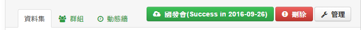

# 透過 API 上傳至國發會


### 確認 ckanext-scheming plugin 格式
---

* 於 dataset 綱目中確認資料類型為正確

```bash
    // ...

    {
      "field_name": "data_type",
      "label": "資料集類型",
      "choices": [
        { "value": "rawData", "label": "原始資料" },
        { "value": "services", "label": "系統介接程式" },
        { "value": "apps", "label": "行動化應用軟體" },
        { "value": "tools", "label": "其他" }
      ],
      "form_snippet": "select.html",
      "display_snippet": "select.html"
    },
    
    // ...
```

* 確認完畢後，重新安裝及啟動即可

### 於 PostgreSQL DB 中加入 ndcsync 表格紀錄同步狀態
---

```bash
# 登入 postgresql service
$ psql -U ckan_default

# 進入 ckan 資料庫
\connect ckan_default

# 加入一張新表
CREATE TABLE ndcsync ( id serial primary key, cdcid text not null, ndcid text, state text NOT NULL, operation text not null, beginning date, ending date, code text, progress text );

# 表格綱目如下
#  Column   |  Type   |                      Modifiers                       | Storage  | Stats target | Description
#-----------+---------+------------------------------------------------------+----------+--------------+-------------
# id        | integer | not null default nextval('ndcsync_id_seq'::regclass) | plain    |              |
# cdcid     | text    | not null                                             | extended |              |
# ndcid     | text    |                                                      | extended |              |
# state     | text    | not null                                             | extended |              |
# operation | text    | not null                                             | extended |              |
# beginning | date    |                                                      | plain    |              |
# ending    | date    |                                                      | plain    |              |
# code      | text    |                                                      | extended |              |
# progress  | text    |                                                      | extended |              |
```

### 加入自定義類別 py2psql (py to psql) 及 REQUESTMETHOD
---

* py2psql : Python 與 PostgreSQL 溝通類別
* REQUESTMETHOD : 透過 Python 傳送 GET/POST/PUT/DELETE 方法

```bash
# python 2.7 函式庫預設位置
$ cd /usr/lib/python2.7/

# 取得 py2psql 程式碼
$ sudo wget https://raw.githubusercontent.com/jiankaiwang/seed/master/python/py2psql.py

# 取得 TEXTCODING 程式碼
$ sudo wget https://raw.githubusercontent.com/jiankaiwang/seed/master/python/TEXTCODING.py

# 取得 REQUESTMETHOD2 程式碼
$ sudo wget https://raw.githubusercontent.com/jiankaiwang/seed/master/python/REQUESTMETHOD2.py
```

### 加入同步函式入 helpers.py
---

```python
# 進入虛擬機
$ . /usr/lib/ckan/default/bin/activate

# 加入功能入 helpers.py
$ vim /usr/lib/ckan/default/src/ckan/ckan/lib/helpers.py
```

* 加入定義與內容可以參考 helpere.py
* 並需確認已有替換 Authorization 的 api-key

### 加入上傳 icon
---

* 增加同步於或自國發會刪除資料集按鈕，修改 ** templates/package/read_base.html ** 頁面 (管理員有刪除權限)

```html

{# ... #}


  

  {#<button class="btn btn-warning">{{ request.method }} {{ request.body }}</button>#}

{# only admin can sync with NDC #}


  {# customized : upload to NDC #}
  
      
      
          {# sync #}
          <button class="btn btn-warning">
              <i class="icon-repeat"></i>
              {{ state["note"] }}
          </button>
          {# refresh for current state #}
          <meta http-equiv="refresh" content="15;url={{ _('{0}dataset/{1}').format(h.url_for(controller='home', action='index'), pkg['name']) }}"></meta>
      
          {# submit/success/failure #}
          <form method="post" name="upload" action="#" class="sumbit-form">
          
              {# the first submit or already submitted succefully #}
              <button class="btn btn-primary" name="save" type="submit" style="display: inline-block;" value="DataGovTW">
                  <i class="icon-cloud-upload"></i>
                  {{ _('國發會({0})').format(state["note"]) }}
              </button>
          
              <button class="btn btn-danger" name="save" type="submit" style="display: inline-block;" value="DataGovTW">
                  <i class="icon-cloud-upload"></i>
                  {{ _('國發會({0})').format(state["note"]) }}
              </button>
          
          </form>

          {# allow delete #}
              
                  {# not submitted to NDC yet #}
                  <button class="btn btn-warning" name="delete" style="display: inline-block;">
                      <i class="icon-exclamation-sign"></i>
                      {{ h.getLangLabel("Unsubmitted","未建立") }}
                  </button>
              
                  {# only PUT (means already POST before) can be deleted #}
                  <form method="post" name="uploadForDelete" action="#" class="sumbit-form">
                      <button class="btn btn-danger" name="delete" type="submit" style="display: inline-block;" value="FromDataGovTW">
                          <i class="icon-exclamation-sign"></i>
                          {{ h.getLangLabel("Delete","刪除") }}
                      </button>
                  </form>
              
      

  
      
      
          {# sync #}
          <button class="btn btn-warning" name="save" type="submit" style="display: inline-block;" value="noaction">
              <i class="icon-repeat"></i>
              {{ state["note"] }}
          </button>
      
          {# start sync to ndc : POST or PUT #}
          
          <button class="btn btn-warning" name="save" type="submit" style="display: inline-block;" value="noaction">
             <i class="icon-repeat"></i>
             {{ _("Start Syncing") }}
          </button>
       

       {# refresh for prepare data submitting #}
       <meta http-equiv="refresh" content="3;url={{ _('{0}dataset/{1}').format(h.url_for(controller='home', action='index'), pkg['name']) }}"></meta>
       {#<meta http-equiv="refresh" content="1;url={{ _('{0}dataset').format(h.url_for(controller='home', action='index')) }}"></meta>#}
  
       {# delete both cdc and ndc #}
       
       <button class="btn btn-warning">
           <i class="icon-repeat"></i>
           {{ _("Start Deleting") }}
       </button>

       {# refresh for deleting data #}
       <meta http-equiv="refresh" content="3;url={{ _('{0}dataset/{1}').format(h.url_for(controller='home', action='index'), pkg['name']) }}"></meta>

  

{# admin #}


    
  



  {{ h.build_nav_icon('dataset_read', _('Dataset'), id=pkg.name) }}
  {{ h.build_nav_icon('dataset_groups', _('Groups'), id=pkg.name) }}
  {{ h.build_nav_icon('dataset_activity', _('Activity Stream'), id=pkg.name) }}


{# ... #}
```

* 修改 CSS 樣式表，並加入底下樣式

```bash
$ vim /usr/lib/ckan/default/src/ckan/ckan/public/base/css/general.css
```

```css
/* upload to NDC */
.sumbit-form {
  display: inline-block;
  margin: 0px;
}
```

* 完成後的樣式範本如下；



