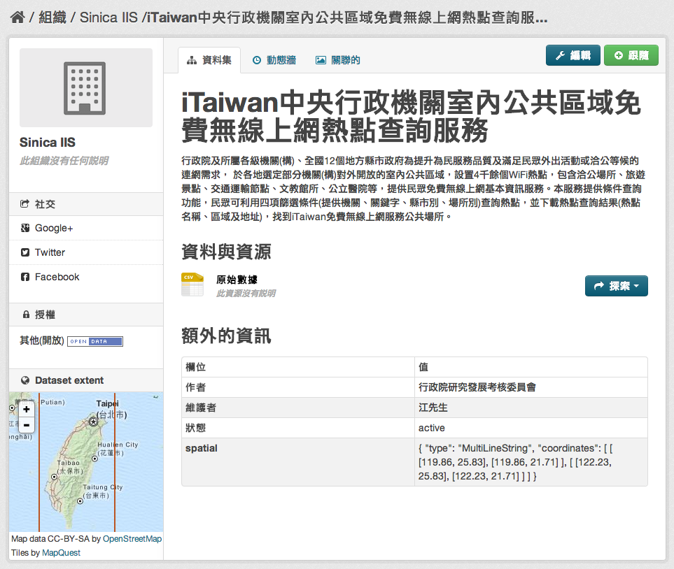

# ckanext-spatial
###功能簡介
---
* Spatial Metadata
建立地理空間資訊之索引。

* Spatial Search Widget
    * 按地圖搜尋資料集 “spatial” 欄位的地理空間資訊。安裝完成後，即可在資料集清單顯示頁面的左下角看到 “Filter by location” 的區塊，此區塊並可放大後，依照使用者選取的地理區域篩選出符合的資料集。
    * 欲使用此功能，請在 ckan.plugins 加入 spatial_metadata 與 spatial_query。

* Dataset Extent Map
    * 以地圖顯示資料集 “spatial” 欄位所述之地理空間資訊 (僅支援 geojson 格式)。如下圖所示，在「額外的資訊」中填寫的 spatial geojson 資訊，將顯示在左下角的 Dataset extent 中。
    * 欲使用此功能，請在 ckan.plugins 加入 spatial_metadata。



* CSW Server
    * 提供 CSW 服務介面。

* Spatial Harvesters
    * 提供地理空間相關的 harvesters，可以將 CSW, WAF, spatial metadata document 等資料目錄來源的後設資料擷取下來並匯入 CKAN 之中，資料本身仍位於原資料目錄之網站。
    * 此 harvester 係實作 ckanext-harvest 套件之 harvester interface。
    * 欲使用此功能，請安裝 [ckanext-harvest 外掛](https://github.com/okfn/ckanext-harvest) 並在 ckan.plugins 加入 csw_harvester, doc_harvester 與 waf_harvester。

| 註解 |
| -- |
| \* 若您有成功安裝 ckanext-spatial 套件並啟用上述三個 plugins，應該可以看到 “CKAN, CSW Server, Web Accessible Folder (WAF), Single spatial metadata document” 四種 source 類別。<br> \* ckanext-spatial 提供的 havester 現階段 (0.2) 並不穩定，匯入大量資料很緩慢（實測 11,400 筆左右需時 3 小時），且容易因 source 缺少某些欄位值或 source 資料格式與 harvester（及其相依的 python library）不符而引發 python exception。<br> \* 實測結果，CSW 可能會有問題（見下方說明）、WAF 可以運作（但資料需符合 ISO 19139 規範）。 |


其使用方式與一般 CKAN harvester 相同，請參考 [ckanext-harvest](http://jkwpro.no-ip.info:8080/ckan2/index.html#document-ckanext-harvest)
* TGOS（國土資訊圖資服務平台）CSW source harvesting 經驗：
    * 嘗試將 TGOS 提供之 [CSW 服務](http://tgos.nat.gov.tw/tgos/Web/TGOS_Home.aspx) ，透過 spatial harvester 匯入 CKAN，結果會發生 list out of range exception。
    \* 原因是 spatial harvester 使用的 OWSLib 這個 python library 判斷 csw source 的 xml tag gmd:identificationInfo 時，認定其下只有一個子 tag MD_DataIdentification ， 但 TGOS 有部份的資料卻有兩個 MD_DataIdentification （ 如此例 ） ，因此造成 python 錯誤。
    * 原先懷疑是 TGOS 不符合 ISO19139 規範，但基本上 ISO 應無要求 tag 的數量只能有一個。
    * 所以 TGOS 匯入 CSW 失敗，既不是 ckanext-spatial 套件本身的問題，也不是 TGOS csw 不符合 ISO19139 規範，其實是 OWSLib 的問題。此問題可以藉由簡單修改 OWSLib 原始碼解決。<br>
打開 /usr/lib/ckan/default/local/lib/python2.7/site-packages/owslib/iso.py ，搜尋 'gmd:identificationInfo' ，將：
```Python
for idinfo in md.findall(util.nspath_eval('gmd:identificationInfo', namespaces)):
```
修改為：
```Python
for idinfo in list(md.findall(util.nspath_eval('gmd:identificationInfo', namespaces)))[0]:
```
即可，促使他擷取第一筆資料。<br>
由於 ISO19139 對資料格式的規範並不是非常的嚴謹，今後匯入 CSW 時，仍需 case by case 作調整。<br>
PS. TGOS 有 36,000 個資料集，一次性抓下來需要一天

###系統需求
---
* CKAN (>=1.8)
* solr (>=3.1) 或 PostGIS (>=1.3)


