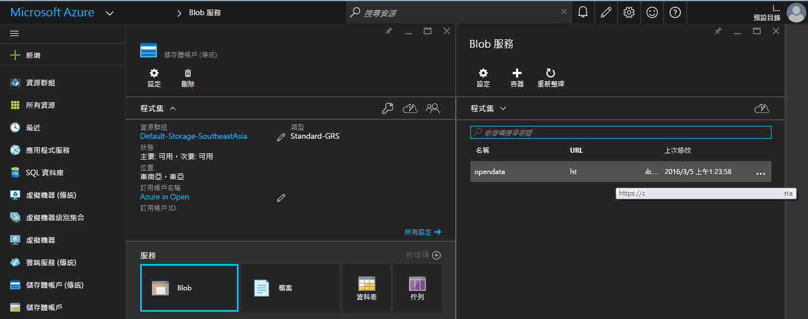
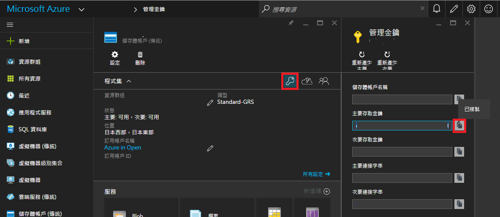

# Copy VHD between storage account

<script type="text/javascript" src="../gitbook/app.js"></script>
<script type="text/javascript" src="../js/general.js"></script>

將 .vhd 從一個 storage account 移至另一個 storage account

###必要資源
---

* Microsoft Azure SDKs : 需要 AzCopy.exe 執行指令

###建立儲存體帳戶與 blob
---

* 於 Azure 上建立儲存體帳戶，並輸入儲存體名稱 (如 dest.core.windows.net)
* 於此儲存體中，點擊服務中的「Blob」，並新增「容器」，並注意存取類型為「Blob」

###取得來源與目的儲存體 Url 與存取金鑰
---

* 取得 URL 方式如下



* 取得存取金鑰方式：點擊金鑰圖，再選取主要存取金鑰



###透過 AzCopy.exe 來將 vhd 檔案進行複製
---

* 假設必要參數如下：
* source : https://xxx.blob.core.windows.net/xxx1/
* destination : https://yyy.blob.core.windows.net/yyy1/
* sourcekey : xxxkey
* destinationkey : yyykey
* pattern (要複製的 vhd) : copy.vhd

* 指令為：

```Bash
AzCopy.exe /source:(url) /Dest:(url) /sourcekey:(sk) /DestKey:(dk) /pattern:(vhd)
```

* 透過命令提示字元完成

```Bash
C:\> cd C:\Program Files (x86)\Microsoft SDKs\Azure\AzCopy

C:\Program Files (x86)\Microsoft SDKs\Azure\AzCopy> AzCopy.exe /source:https://xxx.blob.core.windows.net/xxx1/ /Dest:https://yyy.blob.core.windows.net/yyy1/ /sourcekey:xxxkey /DestKey:yyykey /pattern:copy.vhd
```

* 完成後類似的結果

```Bash
Finished 1 of total 1 file(s).
[2016/06/01 10:11:51] Transfer summary:
-----------------
Total files transferred: 1
Transfer successfully:   1
Transfer skipped:        0
Transfer failed:         0
Elapsed time:            00.00:04:23
```


