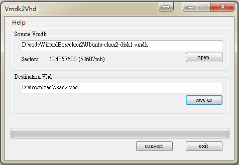
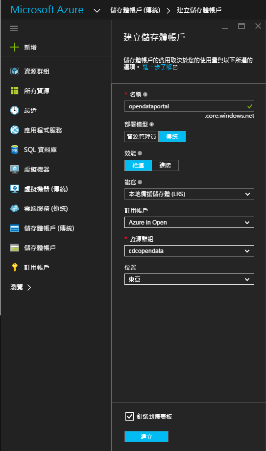
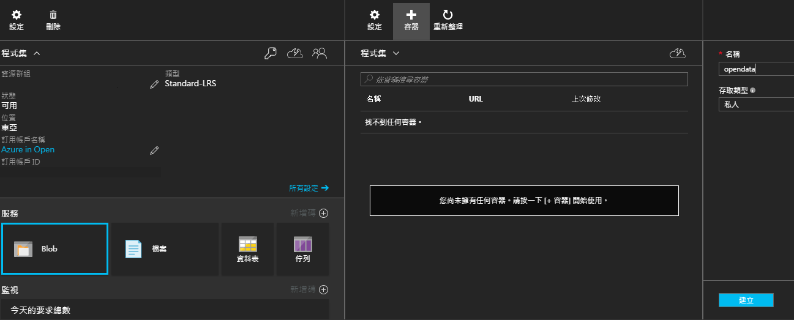
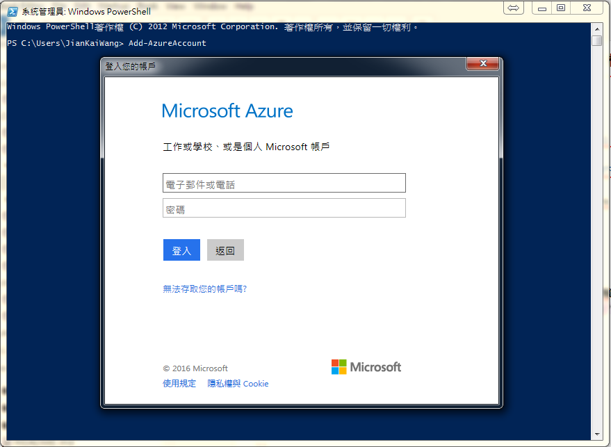
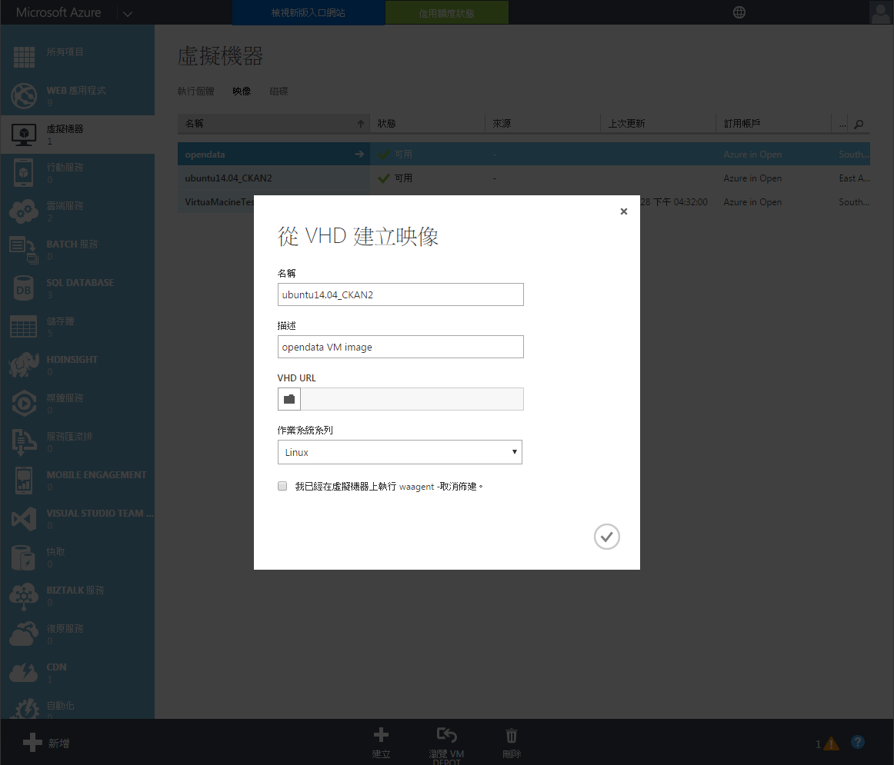
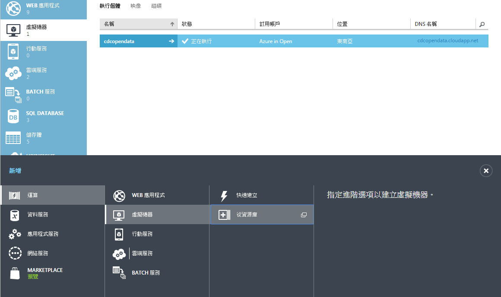
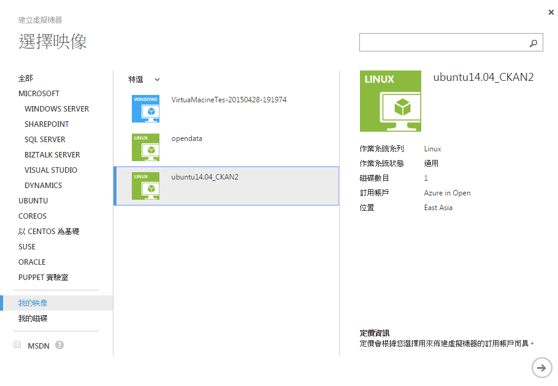

# VirtualBox (.vmdk) 發布到 Microsoft Azure VM

<script type="text/javascript" src="../js/general.js"></script>

很多時候開發團隊會在本機或組織內將服務以 local VM 進行開發，例如 VirtualBox 或是 VMware 等，但隨著雲端技術的演進，便需要將此 local VM 上到雲端，例如 Azure 等。因此本篇將介紹如何將建立在 VirtualBox 的 VM (副檔名為 .vmdk) 轉換到 Azure VM (.vhd)。

過程主要包含三個步驟；
1. 將 VirtualBox 的 .vmdk 檔案轉換成 .vhd 檔案
2. 透過 Azure SDK (PowerShell) 上傳 .vhd 虛擬機檔案 : 透過建立儲存體方式存入
3. 透過網頁來部署虛擬機 : 建立虛擬機並連結含有虛擬機檔案的儲存體

###將 .vmdk 檔案轉換成 .vhd 檔案
---

有下列三種方式來轉換

* 透過微軟的 MVMC (Microsoft Virtual Machine Converter) 工具 : 不推薦

MVMC 工具僅支援少數幾種 VM ，如 VMware vSphere, VMware vCenter 等，與更常見的 VMware Workstation 不相同，雖然 vSphere 可以達成更完整的硬體虛擬化，但對於大部分的開發條件過於大材小用，所以並不常見。

* 透過第三方免費軟體 Vmdk2Vhd ([Offical Download Link](http://www.softpedia.com/get/System/File-Management/Vmdk2Vhd.shtml)) : 推薦使用

相當直覺化的操作，選取代轉換的 vmdk 檔案，並選擇要輸出的路徑，之後便點擊 convert 即可，如下圖；



* 透過第三方共享軟體 WinImage ([Offical Download Website](http://www.winimage.com/download.htm))

###透過 Azure SDK (PowerShell) 進行 .vhd 檔案上傳
---

下載必要工具 (PowerShell) 與 Azure SDK；

* 若有安裝 Visual Studio 2013 版本以上，則預設已安裝 PowerShell，或是透過微軟工具網站 ([Link](https://azure.microsoft.com/zh-tw/downloads/)) 進行下載。

* 因為需要使用 Azure command，如 Add-AzureAccount 等，因此需要下載 Azure SDK 安裝檔 ([說明與下載連結](https://azure.microsoft.com/zh-tw/documentation/articles/powershell-install-configure/))。

於 Azure 網頁上設定準備放置虛擬機的儲存體，新增一個「** 儲存體帳戶 (傳統) **」，點擊「 ** 新增 **」後，在建立儲存體帳戶頁面下進行儲存體設定，假設儲存體名稱為「** opendataportal.core.windows.net **」，之後點擊建立即可，如下；



建立儲存體後，需要在建立一個 container 給準備要上傳的虛擬機使用，於服務中 「Blob」 中，新增一個「容器」，假設容器名稱為「** opendata **」，而其 URL 為「** https://opendataportal.blob.core.windows.net/opendata **」，此 URL 為準備給虛擬機上傳使用的連結，建立方式如下圖；



開啟 PowerShell 並執行 ** Add-AzureAccount ** 指令來登入 Azure，並輸入帳號與密碼，如下圖；

| 註解 |
| -- |
| 如果開啟 PowerShell 並執行 Add-AzureAccount 後出現 ** 無法辨識 'Add-AzureAccount' 詞彙是否為 Cmdlet、函數、指令檔或可執行程式的名稱。請檢查 ... ** 的訊息，便是沒有安裝 ** Azure SDK 安裝檔 (如 WindowsAzurePowershellGet.3f.3f.3fnew.exe) **。 |



登入後，透過 ** Add-AzureVhd ** 指令來上傳轉換後的 .vhd 虛擬機檔案，指令使用方法為如下；

```Bash
Add-AzureVhd -Destination "<BlobStorageURL>/<YourImagesFolder>/<VHDName>.vhd" -LocalFilePath <PathToVHDFile>
```

假設上傳至 azure 儲存體的 vhd 名為 ckan2.vhd，而經第一步驟由 vmdk 轉換的 vhd 放置於 D:\download\ckan2.vhd，並將剛創建 blob (名為 opendata) 的 URL (https://opendataportal.blob.core.windows.net/) 加入，則上傳指令範例如下，

```Bash
PS C:\Users> Add-AzureVhd -Destination "https://opendataportal.blob.core.windows.net/opendata/ckan2.vhd" -LocalFilePath "D:\download\ckan2.vhd"
```

###透過 Azure 網頁連結儲存體並部署虛擬機
---

首先需先將剛上傳的 .vhd 檔案轉換成一個 VM 可以使用的 Image，可以透過兩種方式來達成；

* 透過 ** Add-AzureVMImage ** 指令於 PowerShell 來達成

```Bash
Add-AzureVMImage -ImageName <ImageName> -MediaLocation <VHDLocation> -OS <OSType>
```

```Bash
# 注意 -OS 僅有 Windows 與 Linux 兩類

Add-AzureVMImage -ImageName opendata -MediaLocation "https://opendataportal.blob.core.windows.net/opendata/ckan2.vhd" -OS "Linux"
```

* 透過舊版 Azure 入口 ([https://manage.windowsazure.com](https://manage.windowsazure.com))

選擇「虛擬機器」，點擊「映像」，點擊最下方「建立」，輸入映像檔名稱「ubuntu14.04_CKAN2」(假設)，描述「opendata VM image」(假設)，如下圖；



接下來便是創建一個虛擬機並使用此映像檔即可，點擊右側「虛擬機器」，點擊底下「新增」，點擊「虛擬機器」，點擊「從資源庫」，點擊「我的映像」，選擇「ubuntu14.04_CKAN2」





在虛擬機器設定中「新的使用者名稱」部分，若是自己上傳映像檔，可以隨意填寫，也可以填寫已知的登入與密碼；但若是直接使用 azure 內建映像檔建立者，則需要注意，此為管理者帳號與密碼。

在雲端服務 DNS 名稱部分，則是預設將「虛擬機器名稱」帶入，此為往後連入的網址。在端點部分，因為 AZURE 為 NAT 方式建立，因此建議將常用的 Port 進行設定 (當然往後仍可以自行設定)。

