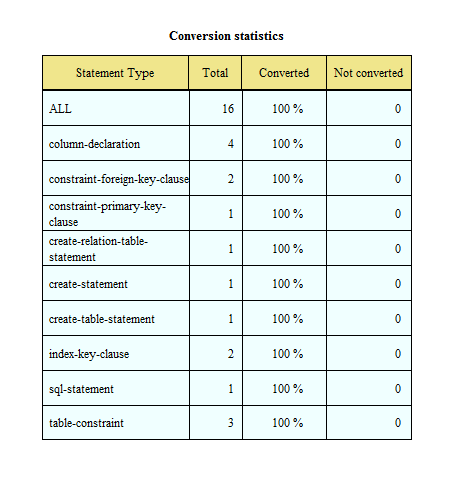

# Import MySQL databases into SQL Server databases

###安裝必要資源
---

* [MySQL ODBC Connector (link)](https://dev.mysql.com/downloads/connector/odbc/)
* [SQL Server Migration Assistant, SSMA (link)](https://blogs.msdn.microsoft.com/ssma/)

###移轉流程如下
---

1. 取得 MySQL 帳號、密碼與 URL (Source)
2. 取得 SQL Server 帳號、密碼與 URL (Target)
3. 透過 「Create Report」 來評估是否能複製平移
4. 透過 「Convert Schema」 將 MySQL DB 的 table schema 轉換到 SQL Server 中
5. 透過 「Migrate Date」 將 MySQL DB 中的 Tables 複製到 SQL Server 中

###細部流程如下
---

* 假設 MySQL Server 帳號、密碼與 URL 分別為 employee_reader, employee, abc.xyz.com

* 假設 SQL Server (2014) 帳號、密碼與 URL 分別為 employee_reader, employee, .\SQLEXPRESS

| 註解 |
| -- |
| 目的將 MySQL 中名為 employees 的資料庫完整複製一份至本機 SQLEXPRESS 中的名為 employees 資料庫 |

* 「File」, 「New Project」, Migrate To 「SQL Server 2014」

* 點擊 「Create Report」 進行轉換評估，可能得到結果如下圖；

「Converted」 100% 表示評估後皆能完全轉換。

* 點擊 「Convert Schema」 將 table schema 進行轉換

* 點擊 「Migrate Data」 將資料從 MySQL 複製一份至 SQL Server 中

