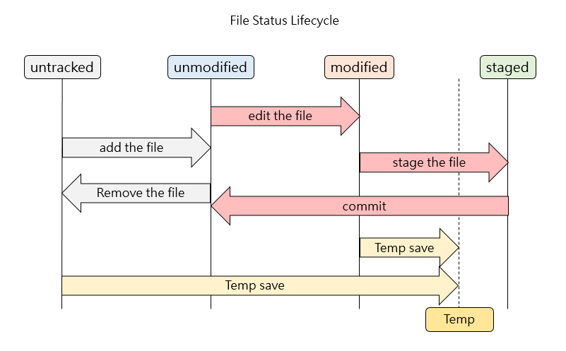

# git 資料結構 - 索引結構

* 索引 : 紀錄「有哪些檔案即將要被提交到下一個 commit 版本中」，若是要提交一個新的版本到 Git 儲存庫，必需要先更新索引狀態，變更提交才會成立。

* 索引於許多文章的別名：
  1. index (索引)
  2. Cache (快取)
  3. Directory Cache (目錄快取)
  4. Current directory cache (現在目錄快取)
  5. Staging area (等待被 commit 區域)
  6. Staged files (等待被 commit 檔案)

因此，指令 ** git diff --cached ** 與 ** git diff --staged ** 便是同義。

###操作檔案索引
---

* untracked : 未被追蹤的，代表尚未加入 Git 儲存庫的狀態
* unmodified : 未被修改的檔案，可能為第一次被加入或是檔案內容與 Head 一致的狀態
* modified : 已被修改，表示檔案可能編輯過，或是檔案內容與 Head 不一致 (如檔案覆蓋)
* staged : 等待被 commit，表示下一次 git commit 會將之送入儲存庫中

