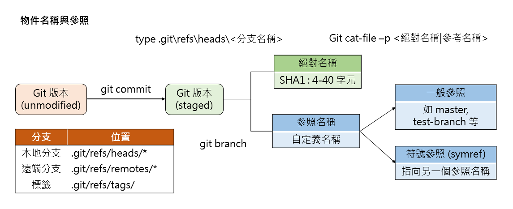
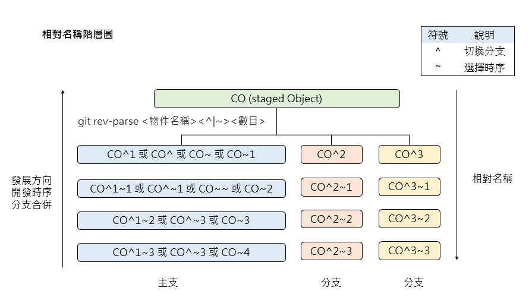
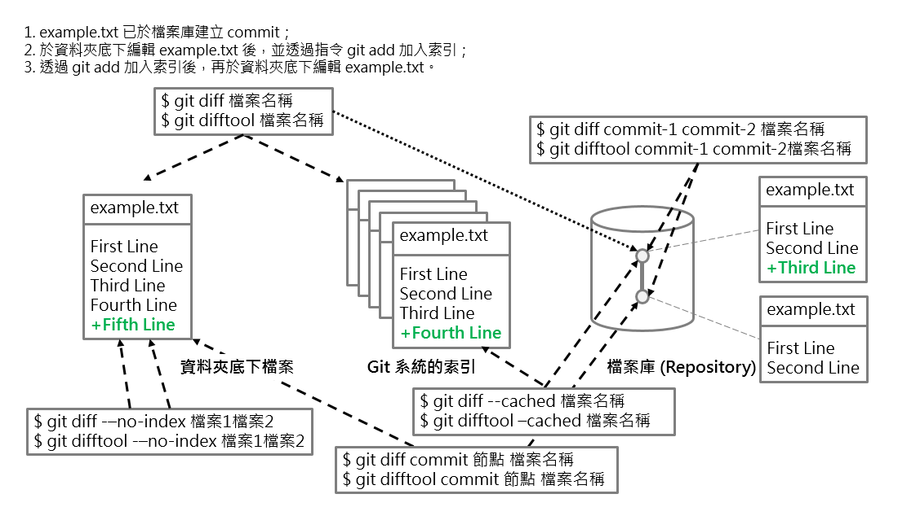

# git 物件 - 名稱與參照

## Git 物件名稱與參照



## Git 物件的相對參照

* 相對名稱表示 : 
```text
<參照名稱|絕對名稱><~|^><數目>
```
  1. 數目 : 該物件的前幾個版本
  2. ~ : 第一個上層 commit 物件
  3. ^ : 擁有多個上層(分支合併後) commit 物件時，要代表第幾個第一代的上層物件
  4. e.g. C^3~3 : C commit 物件第 3 個分支的上三層物件

* 相對名稱的階層表示 :



## Git 比對




