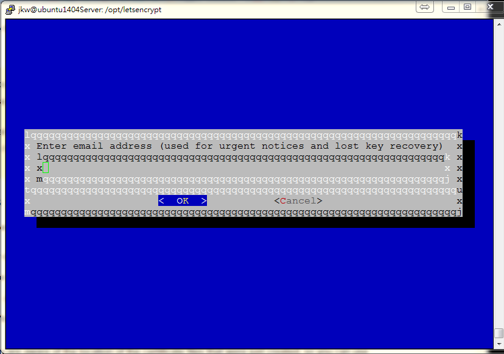
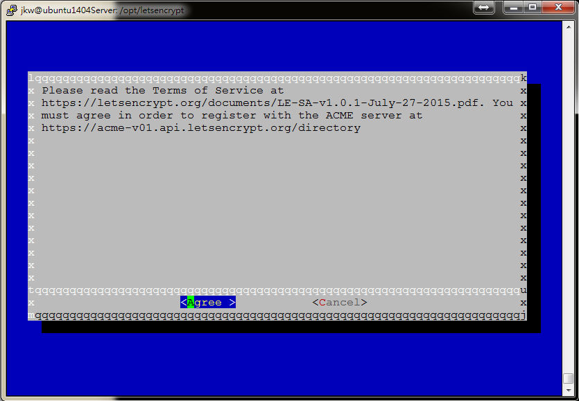
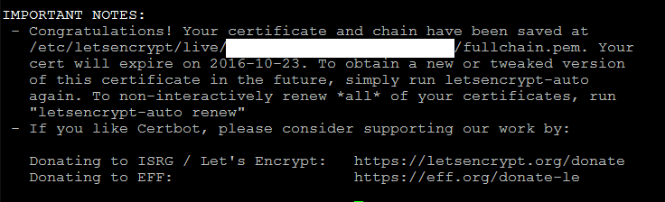

# Secure Nginx with Let's Encrypt on Ubuntu 14.04

<script type="text/javascript" src="../js/general.js"></script>

### Requirement
---

* Ubuntu 14.04 with non-root user who has ** sudo ** privileges
* own or control the registered domain name
* (lowest) A Record points your domain to the public IP address of the server

### Step.1 : install Let's Encrypt Client
---

* install Git and bc

```bash
# update the server's package
$ sudo apt-get update

# install necessary git and bc packages
$ sudo apt-get -y install git bc
```

* install ** letsencrypt ** from github to local /opt/letsencrypt

```bash
$ sudo git clone https://github.com/letsencrypt/letsencrypt /opt/letsencrypt
```

### Step.2 : Obtain a Certificate
---

* Here, we demonstrate using **Webroot** plugin to obtain an SSL certificate.
  * The Webroot plugin works by placing a specific file in the directory /.well-known

```bash
$ sudo mkdir /.well-known
```

* Install nginx (skip if it is already installed)

```bash
$ sudo apt-get install nginx
```

* Set configuration of nginx server

```bash
# edit nginx default configuration
$ sudo vim /etc/nginx/sites-available/default
```

```bash
# add the access directory to the block server (inside server block)
location ~ /.well-known {
        allow all;
}
```

```bash
# the default document root for using Webroot plugin 
/usr/share/nginx/html
```

* Reload Nginx Service

```bash
$ sudo service nginx reload
```

* Create a SSL Certificate
  * specify our domain name with **-d** option
  * if you want a single cert to work with multiple domain names (e.g. example.com or www.example.com, etc.), be sure to include all of them.

```
# the exmaple command is 
./letsencrypt-auto certonly -a webroot --webroot-path=/usr/share/nginx/html -d example.com -d www.example.com
```

* the following is the example using example.no-ip.biz

```
cd /opt/letsencrypt
./letsencrypt-auto certonly -a webroot --webroot-path=/usr/share/nginx/html -d example.no-ip.biz
```

| 註解 |
| -- |
| If there is error, the log would be ** /var/log/letsencrypt/ ** . If the message is "** let's encrypt policy forbids issuing for name **", it means the domain name is not allowed for let's encrypt, e.g. cloudnapp.net, Amazon EC2, etc. |

Let's encrypt takes E-mail as a part of Certificate



Also, the term of service is the following :



* after Let's encrypt initialization and if it is successfully generated, notes would be like bellow



* The Certificate files are also generated

```bash
# the default path for certificate files
cd /etc/letsencrypt/live/example.no-ip.biz/
```

```bash
# cert.pem : the domain's certificate
cert.pem -> ../../archive/cdcopendatatest.no-ip.biz/cert1.pem

# chain.pem : the let's encrypt chain certificate
chain.pem -> ../../archive/cdcopendatatest.no-ip.biz/chain1.pem

# fullchain.pem : combine both cert.pem and chain.pem
fullchain.pem -> ../../archive/cdcopendatatest.no-ip.biz/fullchain1.pem

# privkey.pem : the certificate's private key
privkey.pem -> ../../archive/cdcopendatatest.no-ip.biz/privkey1.pem
```

| 註解 |
| -- |
| The certificate files would be truely located on ** /etc/letsencrypt/archive **, but the Let's encrypt create symbolic links to the ** most recent certifcate files ** in the directory ** /etc/letsencrypt/live/domain_name ** |

* In most conditions, you will configure your server to use ** fullchain.pem ** as the certificate file, and ** privkey.pem ** as the certificate key file.

* Generate Strong Diffie-Hellman Group (2048-bit)

```
$ sudo openssl dhparam -out /etc/ssl/certs/dhparam.pem 2048
```

### Step.3 : Configure TLS/SSL on Web Server (Nginx)
---

* Edit nginx configure file

```bash
$ sudo vim /etc/nginx/sites-available/default
```

* comment or delete the following settings inside the server block because ssl usually takes port 443

```bash
       # listen 80 default_server;
       # listen [::]:80 default_server ipv6only=on;
```

* start to configure ssl on port 443 inside the server block

```bash
        listen 443 ssl;

        server_name example.com www.example.com;

        ssl_certificate /etc/letsencrypt/live/example.no-ip.biz/fullchain.pem;
        ssl_certificate_key /etc/letsencrypt/live/example.no-ip.biz/privkey.pem;
```

* additionally, secure ssl protocols and ciphers to use Diffie-Hellman group generated, add the following settings to the server block

```bash
        ssl_protocols TLSv1 TLSv1.1 TLSv1.2;
        ssl_prefer_server_ciphers on;
        ssl_dhparam /etc/ssl/certs/dhparam.pem;
        ssl_ciphers 'ECDHE-RSA-AES128-GCM-SHA256:ECDHE-ECDSA-AES128-GCM-SHA256:ECDHE-RSA-AES256-GCM-SHA384:ECDHE-ECDSA-AES256-GCM-SHA384:DHE-RSA-AES128-GCM-SHA256:DHE-DSS-AES128-GCM-SHA256:kEDH+AESGCM:ECDHE-RSA-AES128-SHA256:ECDHE-ECDSA-AES128-SHA256:ECDHE-RSA-AES128-SHA:ECDHE-ECDSA-AES128-SHA:ECDHE-RSA-AES256-SHA384:ECDHE-ECDSA-AES256-SHA384:ECDHE-RSA-AES256-SHA:ECDHE-ECDSA-AES256-SHA:DHE-RSA-AES128-SHA256:DHE-RSA-AES128-SHA:DHE-DSS-AES128-SHA256:DHE-RSA-AES256-SHA256:DHE-DSS-AES256-SHA:DHE-RSA-AES256-SHA:AES128-GCM-SHA256:AES256-GCM-SHA384:AES128-SHA256:AES256-SHA256:AES128-SHA:AES256-SHA:AES:CAMELLIA:DES-CBC3-SHA:!aNULL:!eNULL:!EXPORT:!DES:!RC4:!MD5:!PSK:!aECDH:!EDH-DSS-DES-CBC3-SHA:!EDH-RSA-DES-CBC3-SHA:!KRB5-DES-CBC3-SHA';
        ssl_session_timeout 1d;
        ssl_session_cache shared:SSL:50m;
        ssl_stapling on;
        ssl_stapling_verify on;
        add_header Strict-Transport-Security max-age=15768000;
```

* finally redirect port 80 to port 443 to force using https, add the following settings outside the original server block 

```bash
server {
    listen 80;
    server_name example.com www.example.com;
    return 301 https://$host$request_uri;
}
```

* reload Nginx service

```bash
$ sudo service nginx reload
```


* 


