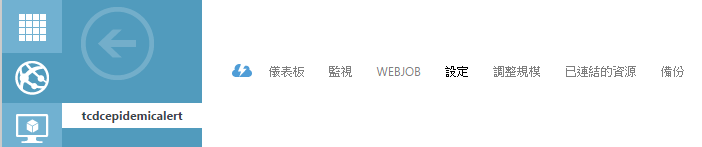
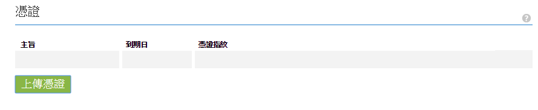
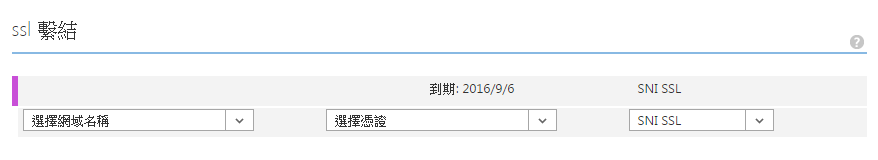

# SSL in Azure Web APP

<script type="text/javascript" src="../js/general.js"></script>

在 Azure 的 Web APP 使用 Let's encrypt 對自定網域進行 SSL 加密。

###取得 Let's Encrypt 所認證的 CRT 與 Private Key
---

必須含有下列 3 項：

* private.key : 使用的私鑰

* certificate.crt : 含有公鑰與認證組織使用的簽名檔

* ca_bundle.crt : 發給網站的 CA 公司 (此處便是 Let's encrypt)

###使用 OpenSSL 產生 PFX 檔案
---

Azure 統一使用 PFX 檔案打包上傳所有的私鑰與簽證檔，也加入一個密碼來使用 PFX。可以透過下列指令來達成，假設打包後的 PFX 檔名為 newPFX.pfx：

```Bash
openssl pkcs12 -export -out newPFX.pfx -inkey private.key -in certificate.crt -certfile ca_bundle.crt 
```

之後輸入未來需要驗證使用 PFX 密碼即可。

###將 PFX 檔案上傳至 Azure 中
---

於 Azure 的操作介面中，選擇「Web 應用程式」，選擇要使用的網站，進入後點選「設定」



於憑證的項目中選擇「上傳憑證」，



將剛由 OpenSSL 產生的 PFX 上傳憑證，並輸入使用密碼。

###SSL 繫結
---

選擇要使用的網域名稱，及剛上傳的憑證，因 Let's encrypt 故選擇 SIN SSL，之後按下「儲存」即可。



###強制使用 https
---

於 Web.config 中加入底下組態設定；

```Xml
<system.webServer>
    <rewrite>
      <rules>
        <rule name="Force HTTPS" enabled="true">
          <match url="(.*)" ignoreCase="false" />
          <conditions>
            <add input="{HTTPS}" pattern="off" />
          </conditions>
          <action type="Redirect" url="https://{HTTP_HOST}/{R:1}" appendQueryString="true" redirectType="Permanent" />
        </rule>
      </rules>
    </rewrite>
</system.webServer>      
```


