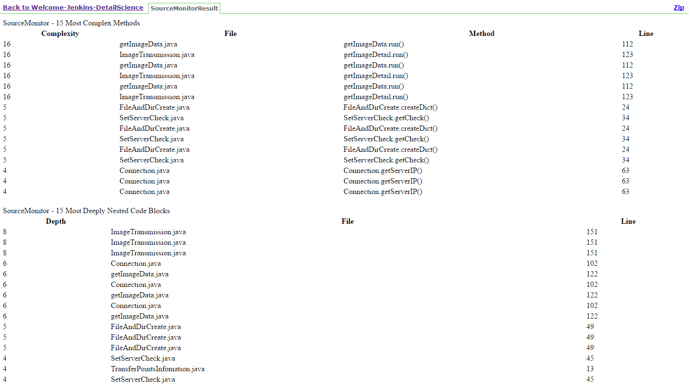

# Jenkins 整合 SourceMonitor 工具

<script type="text/javascript" src="../js/general.js"></script>

* SourceMonitor 為一分析程式碼複雜度的工具。

###報表內容準備
---

* 於安裝 SourceMonitor 資料夾下準備 command 運行用的 **sample_commands.xml** 設定組態檔。

```bash
# 一般而言，是位於安裝路徑下
C:\Program Files (x86)\SourceMonitor\Samples\sample_commands.xml
```

* 修改範例如下
  1. 於桌面放置一資料夾 (demo)，內含有數份 Java 程式碼
  2. 將 SourceMonitor dump 出來的結果輸出至桌面

```XML
<?xml version="1.0" encoding="UTF-8" ?>

<sourcemonitor_commands>

    <write_log>true</write_log>

    <command>
        <project_file>C:\Users\JianKaiWang\Desktop\demo.smp</project_file>
        <project_language>Java</project_language>
        <modified_complexity>true</modified_complexity>
        <source_directory>C:\Users\JianKaiWang\Desktop\demo</source_directory>
        <source_subdirectory_list>
            <exclude_subdirectories>true</exclude_subdirectories>
            <source_subtree>bin\</source_subtree>
            <source_subdirectory>obj\</source_subdirectory>
        </source_subdirectory_list>
        <parse_utf8_files>True</parse_utf8_files>
        <checkpoint_name>Baseline</checkpoint_name>
        <checkpoint_date>2016-07-12T14:14:56</checkpoint_date>
        <file_extensions>*.java</file_extensions>
        <include_subdirectories>true</include_subdirectories>
        <ignore_headers_footers>2 DOC only</ignore_headers_footers>
        <ignore_headers_footers>True</ignore_headers_footers>
        <export>
            <export_insert>xml-stylesheet type='text/xsl' href='SourceMonitor.xslt'</export_insert>
            <export_file>C:\Users\JianKaiWang\Desktop\dump.xml</export_file>
            <export_type>1 (project summary as XML)</export_type>
        </export>
    </command>

    <command>
        <project_file>C:\Users\JianKaiWang\Desktop\demo.smp</project_file>
        <project_language>Java</project_language>
        <modified_complexity>true</modified_complexity>
        <source_directory>C:\Users\JianKaiWang\Desktop\demo</source_directory>
        <source_files_from_xml>
            <xml_base_directory>.\src\</xml_base_directory>
            <xml_search_file>
                <xml_file_path>.\MyFiles.xml</xml_file_path>
                <xpath_location>//file</xpath_location>
            </xml_search_file>
            <xml_search_file>
                <xml_file_path>.\Other\MyOtherFiles.xml</xml_file_path>
                <xpath_location>other_file@file_name</xpath_location>
            </xml_search_file>
        <source_files_from_xml>

        <parse_utf8_files>True</parse_utf8_files>
      
        <export>
            <export_insert>xml-stylesheet type='text/xsl' href='SourceMonitor.xslt'</export_insert>
            <export_file>C:\Projects\dump.xml</export_file>
            <export_type>1 (project summary as XML)</export_type>
        </export>
    </command>

    <command>
        <project_file>C:\Users\JianKaiWang\Desktop\demo.smp</project_file>
        <export>
            <export_file>C:\Users\JianKaiWang\Desktop\dump.xml</export_file>
            <export_type>2 (checkpoint details as XML)</export_type>
        </export>
        <delete_checkpoint />
    </command>

    <command>
        <project_file>C:\Users\JianKaiWang\Desktop\demo.smp</project_file>
        <checkpoint_name>Alpha One</checkpoint_name>
        <export>
            <export_file>C:\Users\JianKaiWang\Desktop\dump.xml</export_file>
            <export_type>3 (project details as CSV)</export_type>
        </export>
    </command>

    <command>
        <project_file>C:\Users\JianKaiWang\Desktop\demo.smp</project_file>
        <export>
            <export_file>C:\Users\JianKaiWang\Desktop\dump.xml</export_file>
            <export_type>2 (project details as XML)</export_type>
            <export_option>Include method metrics: option 3</export_option>
            <export_all_checkpoints />
        </export>
    </command>
</sourcemonitor_commands>
```

* 準備於 Jenkins 中呈現報表使用的檔案

因 SourceMonitor 沒有自身開發的顯示頁面，故主要是透過 ** HTML Publisher Plugin ** 來顯示於 Jenkins 的專案畫面上。而為了使用此 plugin，需要有兩個專屬 SourceMonitor 使用的 xsl 模版， ** SourceMonitor.xsl ** 及** SourceMonitorSummaryGeneration.xsl **。

###安裝與設定 HTML Publisher Plugin
---

* 於 Jenkins Server 系統頁面，選擇左側「管理 Jenkins」中「管理外掛程式」，選擇「HTML Publisher plugin」，並進行安裝即可。

* 開啟 SourceMonitor，並確定允許編碼 UTF-8 掃描的選項為開啟。

```text
# 設定方式如下
「File」 > 「Options」 > 「Allow parsing of UTF-8 files」
```

* 下載 [msxsl.exe (Command Line Transformation Utility tool)](https://www.microsoft.com/en-us/download/details.aspx?id=21714)
  1. 能在 xsl 與 xml 檔案之間進行轉換
  2. 將 xml 檔案轉換成 html 檔案

* 安裝完後，進入要使用此 plugin 的專案，因此 plugin 功能為掃描靜態程式碼，選擇左側的「組態」中「建置」，選擇「執行 Windows 批此指令」，並批次完成下列各項指令
  1. 執行前述步驟準備的 example_commands.xml
  2. 透過 msxsl.exe 將產生的 xml 報表內容透過 xsl 格式轉換成準備給 html 輸出用的內容格式
  3. 轉換成 report html (此檔案為 html publisher plugin 使用)

```bash
"C:\Program Files (x86)\SourceMonitor\SourceMonitor.exe" /C "D:\code\jenkins\sourcemonitor\htmlpublisher\example_commands.xml"

"D:\code\jenkins\sourcemonitor\msxsl.exe" "C:\Users\JianKaiWang\Desktop\dump.xml" "D:\code\jenkins\sourcemonitor\htmlpublisher\SourceMonitorSummaryGeneration.xsl" -o "C:\Users\JianKaiWang\Desktop\SourceMonitorSummaryGeneration.xml"
 
"D:\code\jenkins\sourcemonitor\msxsl.exe" "C:\Users\JianKaiWang\Desktop\SourceMonitorSummaryGeneration.xml" "D:\code\jenkins\sourcemonitor\htmlpublisher\SourceMonitor.xsl" -o "C:\Users\JianKaiWang\Desktop\SourceMonitorResult.html"
```

* 將上述指令輸入建置的批次指令後，新增一「建置後動作」，並以「Publish HTML reports」為輸出內容，並將剛輸出的結果 ** SourceMonitorResult.html ** 新增成一份輸出報表即可。

* 而在專案管理頁面中，任一次的建置結果 (如 \#10) 下，其左側「HTML Report」中便有相關結果，如下；




