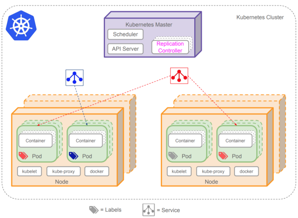

# Kubernetes

* 容器管理應用系統 (Containerized Applications)
* 原由 Google 開發並維護，後捐贈給 Linux Foundation 並進行維護。

## Architecture

From https://docs.google.com/drawings/d/1O66Qhzw0sjCgGwdR7GI7_GhQ8ibhhhGrwAsasHcVR_k/edit.

Kubernetes 主要由三部分組成，**Cluster** (紫色) 用來管理底下橘色的 Node。**Pod** 封裝 Container，若要對服務進行 scaling，會以 pod 為單位新增或刪減，為 immutable deploy 的最小單位。**Service** 需先定義後，才能使外部使用者訪問。

## Content

* Use [Minikube](minikube.md)
* Quick Start
* 

