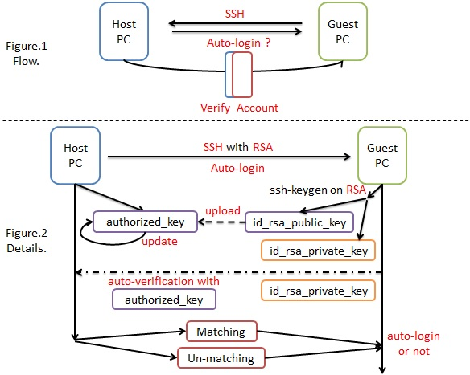

# Autologin SSH in RSA


###Introduction and Background
---

Show the flow of basic ssh connection.



Figure.1 showed:

* The basic and normal procedure is that guest PC trying to communicate with host PC though ssh protocol must pass the verification of account, including its password.

* But, it is a problem when updating or back-up, especially Linux command rsync supporting ssh protocol. So, is there any solution which could directly login the account and then more instructions could be directly processed. One of the non-symmetric cryptography methods, RSA, was developed to solve such problem.

Figure.2 showed the workflow of the whole procedure:

* The RSA strategy is to generate a pair of keys, public and private, they could be examine each other by a hard-to-decryptography mathematical formula.

* Public key could upload to host PC and then guest PC would use its own private key to examine whether they are a pair to verify whether guest PC is the authorized one when connecting.

* First, guest PC use ssh-keygen to generate a pair of key, id_rsa_public_key and id_rsa_private_key, in order to represent itself.

* Second, upload id_rsa_public_key to the host OS and then save the key into authorized_key as setting a lock on the door to wait for its corresponding key, id_rsa_private_key.

* Third, after saving the public key, a new connection through ssh would automatically access the whole authorized_key to match the private_key of guest PC. If the matching is achieved, the login would directly pass and the manual verification would not exist. On the contrary, If the matching is not successful, the login process would request further verification for the guest PC.

###Basic command and Several parameters
---

**The following is the example showing how root@guest_PC automatically login the root@host_PC.**

* First, guest PC generated the RSA paired keys to represent itself.

```Bash
# ssh-keygen -t rsa
```

```Bash
Enter file in which to save the key (/root/.ssh/id_rsa): (none -> would create directory, /root/.ssh)
Enter passphrase (empty for no passphrase): (none -> not to set the deadline)
Enter the same passphrase again: (none or must be the same with the above option)
Your identification has been saved in /root/.ssh/id_rsa. (this is the id_rsa_private_key)
Your public key has been saved in /root/.ssh/id_rsa.pub. (this is the id_rsa_public_key)
The key fingerprint is: 
(256 bits with hex-bit carry) "root@CentOS" (these keys represent this id)
```

* Second, make sure the id_rsa_public_key and id_rsa_private_key were generated.

```Bash
# cd /root/.ssh/
# ls -al
```

```Bash
id_rsa   id_rsa.pub
```

* Third, upload the id_rsa_public_key to host PC by scp.

```Bash
# -P (P is Uppercase) : by what ports
# scp -P 9022 id_rsa.pub root@host_PC:~/id_rsa_root.pub
```

```Bash
(root@host_PC could be replaced as root@192.168.1.10, IP address)
Are you sure you want to continue connecting (yes/no)? yes
root@192.168.2.46`s password: (enter the password of root@host_PC)
id_rsa.pub                                      100%   396              0.4KB/s   00:00    (uploading is finished)
```

* Fourth, add the id_rsa_public_key into the authorized_key hold by host PC.

```Bash
# ssh root@host_PC    (or root@192.168.1.10, root@IP address)
```

```Bash
root@host_PC's password: (Enter the password for root on the host PC)
[root@host_PC ~]#             (The beginning state on the host_PC)
```

```Bash
# ls
```

```Bash
anaconda-ks.cfg id_rsa_root.pub install.log install.log.syslog
```

```Bash
# cat ./id_rsa_root.pub >> ./.ssh/authorized_keys
# exit 
```

* Five, re-login to make sure the authorization worked.

```Bash
# ssh root@host_PC    (or root@192.168.1.10, root@IP address)
```

```Bash
Last login: Mon Mar 31 20:09:52 2014 from 192.168.2.254
[root@host_PC ~] #                                     (auto-login and wait for the command)
```

* Sixth, delete the file, id_rsa_public_key, located on the host PC.

```Bash
# rm -f ./id_rsa_root.pub
# ls
```

```Bash
anaconda-ks.cfg   install.log   install.log.syslog
```


