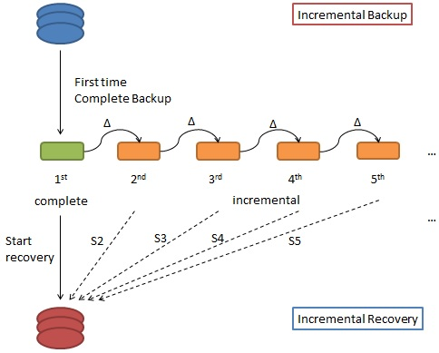
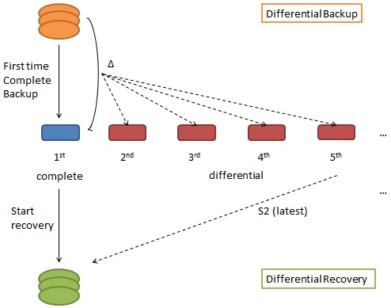
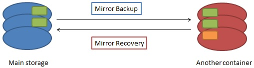

# Backup strategies

There are several policies to backup the data, such like the **incremental backup**, **differential backup** and **mirror backup**. The following are some figures to simply introduce these three policies for backup;

###Incremental Backup
---

* The first time backup would complete backup all needed data. After that, second one would backup different parts from the first one. All incremental backups do the same procedure, ** backup data which didn't exist on the previous version **, the third one would backup different parts from the second one. 

* The recovery based on incremental backup would face more complicated processes, ** it must start the first backup version and step-by-step recovery each version of backup on the same order of backup **.

###Differential Backup
---

* The differential backup at the **first time is the same with incremental backup to store the complete data needed **. After that, construction of second backup would compare the first data to backup the data which does not exist on first one. When it comes to the third backup, it is the same procedure with second one to backup the data which the first, not second, backup does not exist. So ** the main process of the differential backup is to store the difference from the "first" (always the first time) data **. 

* The recovery of the differential backup is more easier than the incremental backup, ** it only need to recovery the first version and the latest one of the backup **. But ** there is a problem that the backup version away from the first one would be quite big and be more and more bigger in the storage **.

###Mirror Backup
---

* The mirror backup is much easier to understand. The mirror backup tries to backup the same object which is latest on the source location and update it on another container. It is similar with "copy" or "move", nut there is a quite difference. The mirror would keep the latest one, if the object in another container, not source, is the latest the mirror backup would not cover it from the same file of source. Second they could keep data already deleted on the source, so mirror backup is quite distinctly from the copy or move command. For example, the data with orange-colored was previous backup to container and deleted from main storage, the backup plans after did not influence one even through the main storage does not exist the origin data. ** The main process of mirror backup is to keep the latest object and other data deleted after the backup **. 

* The recovery is quite intuitive to "copy" or "move" the data from the container to the main storage.

