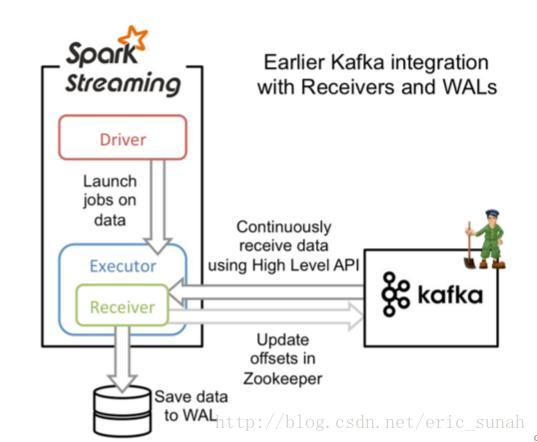
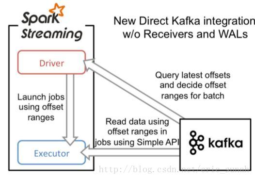

# Spark with Kafka


* Reference:
  * https://blog.csdn.net/eric_sunah/article/details/54096057


There are two types of spark streaming with kafka, based on `Receiver` and `Direct`.


### Receiver

The data from kafka would store in spark's `executor`, then spark streaming would handle it.




### Direct

In direct, we can direct read the value from kafka, but have to record the offsets.





## Official Demo


* Download the jar file `spark-streaming-kafka-0-8-assembly_2.11-2.3.1.jar` from `http://search.maven.org`.
* install the pyspark

```shell
pip install pyspark    # under ~/.local/lib/python3.5/site-packages/pyspark
```

* Run the demo.

```shell
# you have to create a producer and a topic named test first
#
# if you see the continuous info "JobScheduler:54 - Added jobs for time"
# Change the spark-submit master from local to local[2]
# add "--master local[2]"
#
# the following is the example output
# -------------------------------------------
# Time: 2018-06-28 01:58:34
# -------------------------------------------
# ('world,', 1)
# ('hello', 1)
# ('with', 1)
# ('pyspark', 1)
# ('kafka', 1)
#
cd ~/.local/lib/python3.5/site-packages/pyspark
./bin/spark-submit 
	--jars spark-streaming-kafka-0-8-assembly_2.11-2.3.1.jar 
	--master local[2]
	./examples/src/main/python/streaming/kafka_wordcount.py 
	localhost:2181 
	test
```


